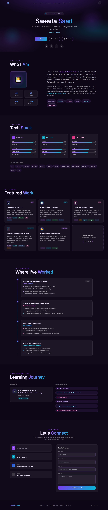

# Day 10: AI Generated Portfolio Website with Claude

##  Objective

Learned how to use Claude AI to generate a professional personal portfolio website without manually writing HTML, CSS, or JavaScript. The goal was to create a modern portfolio that showcases skills, projects, achievements, and contact information while strengthening personal branding.

---

##  Tools Used

* Claude AI
* HTML
* Tailwind CSS (CDN)
* Vanilla JavaScript
* GitHub
* Markdown
* Web Browser

---

##  Folder Structure

```text
Day10/
├── README.md
└── screenshots/
    └── portfolio.png
```

---

##  What I Did

For Day 10, I explored how Claude AI can generate a complete personal portfolio website from a single prompt.

I started by reviewing the provided resources and watching the solution video to understand the workflow. Then, I opened Claude, set the effort level to **Low**, and started a new conversation.

Using the provided portfolio prompt, I replaced all placeholders with my own information, including my name, education, technical skills, projects, experience, achievements, and social links. I also uploaded my resume to allow Claude to generate more accurate and recruiter-friendly content.

Claude generated a modern single-page portfolio website built with HTML, Tailwind CSS, and JavaScript. The website included a hero section, about section, animated skills, project cards, achievements, contact form, dark/light mode toggle, smooth animations, and responsive design.

After generating the website, I saved the output as `portfolio.html`, opened it in my browser, verified its functionality, captured screenshots, and documented the entire process in this repository.

---

##  Portfolio Features

The generated portfolio includes:

* Modern Hero Section
* Animated Typing Effect
* About Me Section
* Skills with Progress Bars
* Technology Tags
* Project Showcase Cards
* Achievements & Certifications
* Contact Form
* GitHub & LinkedIn Links
* Dark/Light Mode Toggle
* Smooth Scroll Animations
* Active Navigation Highlighting
* Fully Responsive Design
* SEO Meta Tags
* Tailwind CSS via CDN
* Single HTML File

---

##  Screenshots

###  portfolio image



---

##  Key Learnings

* AI can generate complete portfolio websites from simple prompts.
* Personal branding plays an important role in career growth and professional visibility.
* Claude can automatically organize resume information into attractive website sections.
* Tailwind CSS enables modern and responsive UI design with minimal effort.
* Prompt engineering significantly improves the quality of AI-generated websites.
* A single HTML file can include advanced features such as animations, dark mode, and responsive layouts without requiring a build process.
* AI-powered development accelerates prototyping and reduces manual coding time.

---

##  Outcome

Successfully generated and tested a fully functional AI-powered personal portfolio website using Claude. Customized the website with personal information, verified its responsiveness, documented the workflow, and prepared it for deployment on platforms such as Vercel or Netlify. This project demonstrated how AI can simplify web development while helping build a strong professional online presence as part of the **#60DaysOfClaude** challenge.
