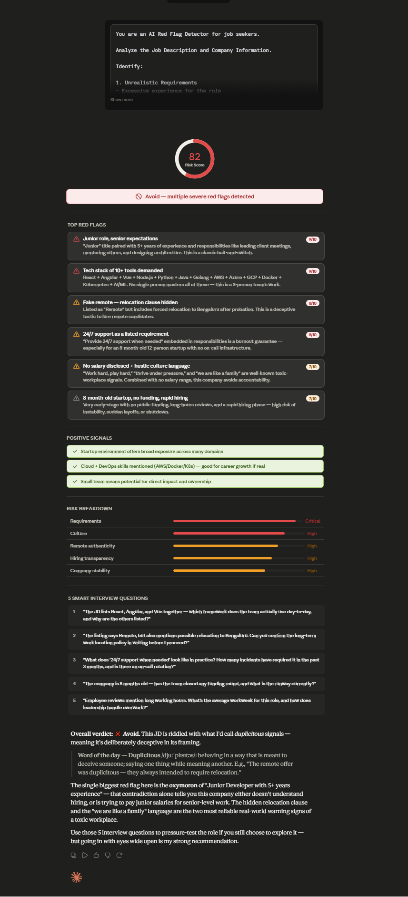

# Day 14: AI Red Flag Detector for Job Applications

## Objective

Learn how to analyze job descriptions and company information using AI to detect hidden risks, misleading claims, toxic work culture signals, and hiring concerns before applying for a job.

This helps job seekers make smarter, safer career decisions.

---

## Tools Used

* Claude AI
* Job Description Analysis Prompt (Red Flag Detector)
* GitHub
* Markdown

---

## Folder Structure

```text
Day-14/
├── README.md
├── analysis/
│   ├── job_description.md
│   ├── company_information.md
│   ├── risk_analysis_report.md
│   ├── red_flags.md
│   ├── positive_signals.md
│   └── interview_questions.md
└── screenshots/
    └── risk_analysis.png

```

## What I Did

For Day 14, I used Claude AI as a **Job Red Flag Detector** to evaluate a real job description and company information before applying.

The goal was to understand whether the job is safe, realistic, and suitable — or if it contains hidden risks like unrealistic expectations, toxic culture, or misleading remote claims.

---

## Step 1: Gather Job Description

- Collected a Junior Full Stack Developer job description  
- Included responsibilities, requirements, benefits, and location details  
- Identified potential inconsistencies in experience and expectations  

---

## Step 2: Gather Company Information

- Collected company background details  
- Checked team size, funding status, and hiring behavior  
- Reviewed employee feedback and transparency level  

---

## Step 3: Run AI Red Flag Detector

- Pasted job description into Claude prompt  
- Added company information  
- Generated structured risk analysis report  

---

## Step 4: Review Risk Analysis

- Checked overall risk score (0–100)  
- Reviewed categorized risk breakdown:
  - Requirements risk  
  - Culture risk  
  - Remote work authenticity  
  - Hiring risks  
  - Company stability  

---

## Step 5: Identify Red Flags & Positives

### Red Flags
- Unrealistic experience requirements detected  
- Heavy workload and “fast-paced culture” signals identified  
- Leadership responsibilities not suitable for junior role  
- 24/7 support expectation indicates potential burnout  

### Company Risks
- Startup is very new (8 months old)  
- No funding transparency  
- Small team size with rapid hiring phase  
- Employee reviews mention long working hours  

### Positive Signals
- Some learning opportunities available  
- Exposure to multiple technologies  
- Remote work flexibility (with conditions)  

---

## Step 6: Final Verdict & Interview Strategy

- Evaluated final recommendation (Apply / Apply with Caution / Avoid)  
- Reviewed AI-generated smart interview questions  
- Used questions to validate company claims before applying  

---

## Screenshots

### Risk Analysis Report



---

## Key Findings

### Job Risks
- Unrealistic expectation: 5+ years experience for a junior role  
- Too many tech stacks required (React, Angular, Vue, Cloud, AI/ML)  
- Leadership and mentoring responsibilities not aligned with junior level  
- 24/7 support requirement indicates burnout risk  

---

### Company Risks
- Startup is very new (8 months old)  
- No public funding information  
- Rapid hiring phase may indicate instability  
- Employee feedback suggests long working hours  

---

### Culture Signals
- “Fast-paced startup” and “work hard play hard” culture  
- Possible overtime pressure  
- Limited work-life balance indicators  

---

## Key Learnings

- Job descriptions often contain hidden contradictions  
- AI helps detect unrealistic hiring expectations early  
- Company transparency is a strong trust indicator  
- Culture keywords can signal burnout risk  
- Remote jobs may still include relocation pressure  
- Always evaluate jobs before applying, not after  

---

## Outcome

Successfully used AI to analyze a real job posting and company profile, identify hidden risks, and generate interview questions for validation.

This improved my ability to evaluate job opportunities more strategically and avoid risky applications.