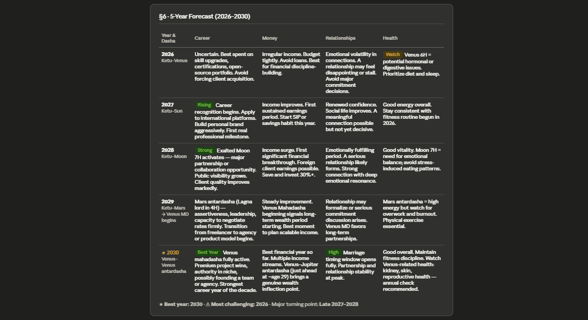

# Day 15: AI Astrology & Life Analysis Report

## Objective

Learn how AI can generate comprehensive life analysis reports by collecting structured personal information and applying multi-step reasoning to produce insights about career, wealth, relationships, personality, and future forecasts.

This exercise demonstrates how high-quality inputs and carefully designed prompts can produce organized, detailed, and actionable reports.

---

## Tools Used

* Claude AI
* Astrology & Life Analysis Prompt
* GitHub
* Markdown

---

## Folder Structure

```text
Day-15/
├── README.md
└── screenshots/
    ├── full_report part 1.png
    ├── full_report part 2.png
    ├── forecast.png
    └── full_report part 4.png
```

---

## What I Did

For Day 15, I used Claude AI to generate a detailed **Astrology & Life Analysis Report** by providing structured personal information such as birth details, profession, relationship status, and current concerns.

The objective was to explore how AI can organize complex inputs into an extensive report containing career guidance, relationship insights, life patterns, forecasts, and practical recommendations.

---

## Step 1: Prepare Structured Information

Provided the following details:

* Full Name
* Gender
* Date of Birth
* Birth Time
* Birth Time Accuracy
* Place of Birth
* Current City
* Relationship Status
* Profession
* Top 3 Current Concerns

This ensured the AI had sufficient context to generate a personalized report.

---

## Step 2: Configure Claude

* Opened a new conversation
* Set reasoning effort to **Low/Medium**
* Pasted the Astrology & Life Analysis prompt
* Submitted all required personal details

---

## Step 3: Generate the Complete Report

Claude processed the structured information and produced a comprehensive report including:

* Personality overview
* Career & Wealth Analysis
* Relationship Analysis
* Life Patterns
* Future Forecasts
* Personalized Recommendations

---

## Step 4: Review Career & Wealth Analysis

Carefully examined:

* Professional strengths
* Financial opportunities
* Potential career growth
* Wealth-building suggestions
* Areas requiring improvement

---

## Step 5: Review Relationship & Life Patterns

Analyzed sections related to:

* Relationship tendencies
* Communication style
* Emotional patterns
* Personal development
* Recurring life themes

---

## Step 6: Review Forecasts & Recommendations

Reviewed AI-generated predictions and suggestions for:

* Career planning
* Financial decisions
* Personal growth
* Relationships
* Long-term goal setting

---

## Step 7: Document Results

* Captured screenshots of important report sections
* Saved generated reports
* Organized files inside the Day-15 folder
* Added documentation to GitHub

---

## Screenshots

### Career & Wealth Analysis & Relationship Analysis


### Forecast & Recommendations



### Complete Report


---

## Key Findings

### Career & Wealth

* AI identified potential strengths and growth opportunities
* Suggested practical approaches for long-term financial planning
* Highlighted areas for skill development and career advancement

---

### Relationships

* Provided insights into communication patterns and emotional tendencies
* Suggested ways to improve interpersonal relationships
* Identified recurring behavioral patterns

---

### Life Patterns

* Organized observations into understandable themes
* Connected personal characteristics with future possibilities
* Offered actionable self-improvement recommendations

---

### Forecasts

* Generated structured future outlooks based on provided information
* Included recommendations for balancing career, finances, and personal life
* Encouraged proactive planning rather than passive prediction

---

## Key Learnings

* Structured inputs significantly improve AI-generated reports
* Multi-step reasoning enables deeper and more organized analysis
* Complex prompts can guide AI through layered report generation
* Personal context allows AI to produce more relevant recommendations
* Forecast sections are most useful when treated as guidance rather than certainty
* Well-designed prompts produce consistent and comprehensive outputs

---

## Outcome

Successfully used Claude AI to generate a structured Astrology & Life Analysis Report by providing detailed personal information. The exercise demonstrated how AI can combine multiple inputs into an organized report containing career insights, relationship analysis, life patterns, forecasts, and actionable recommendations while showcasing the importance of prompt design and structured data collection.
