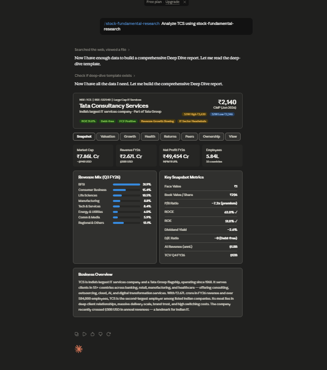

# Day 16: Creating a Custom Stock Fundamental Research Skill with Claude

## Objective

Learn how to create a reusable Custom Skill in Claude that performs structured stock fundamental research. By saving the workflow as a skill, the same analysis framework can be used repeatedly without re-entering lengthy prompts, improving productivity and consistency.

---

## Tools Used

* Claude AI
* Claude Custom Skills
* Stock Fundamental Research Prompt
* GitHub
* Markdown

---

## Folder Structure

```text
Day-16/
├── README.md
└── screenshots/
    └── stock_analysis.png
```

---

## What I Did

For Day 16, I explored Claude's **Custom Skills** feature and learned how to convert a long stock research prompt into a reusable workflow.

Instead of repeatedly copying and pasting the same instructions, I created a permanent skill called **stock-fundamental-research**. Once configured, the skill could instantly generate detailed stock analysis reports for different companies while following the same structured methodology.

---

## Step 1: Explore Custom Skills

Started by learning how Claude's Custom Skills work and how they can save frequently used prompts for future conversations.

The goal was to transform a complex workflow into a reusable capability.

---

## Step 2: Create a New Skill

Created a new Custom Skill with the following details:

* **Skill Name:** `stock-fundamental-research`
* Added the provided description
* Pasted the complete research instructions
* Saved the skill for future use

---

## Step 3: Test the Skill

After creating the skill, I tested it by analyzing a stock such as:

* TCS
* Infosys
* Reliance Industries
* HDFC Bank
* Tata Motors

Claude automatically followed the predefined workflow and generated a structured research report.

---

## Step 4: Generate Fundamental Analysis

The generated report included:

* Company Overview
* Business Model
* Financial Performance
* Revenue Growth
* Profitability Analysis
* Valuation Metrics
* Competitive Position
* SWOT Analysis
* Risk Factors
* Future Outlook

---

## Step 5: Compare Multiple Stocks

I also experimented with comparing two companies using the same Custom Skill.

The comparison included:

* Revenue comparison
* Profitability metrics
* Valuation ratios
* Growth potential
* Competitive advantages
* Investment risks

This demonstrated how reusable workflows simplify repeated analyses.

---

## Step 6: Review Charts & Risk Analysis

Carefully reviewed sections related to:

* Valuation charts
* Ownership trends
* Financial ratios
* Market position
* Key business risks
* Long-term opportunities

The structured output made it easier to understand company fundamentals.

---

## Step 7: Document the Results

Captured screenshots of:

* Custom Skill creation
* Skill configuration
* Generated stock report
* Comparison report
* Valuation analysis

Saved all files inside the Day-16 folder and documented the complete workflow.

---

## Screenshots

## Screenshots

### Custom Skill in Action



The `stock-fundamental-research` Custom Skill successfully generated a comprehensive report for Tata Consultancy Services (TCS), including key financial metrics, valuation insights, business overview, and growth indicators. This demonstrates how reusable AI workflows can simplify and standardize stock research.

---

## Key Findings

### Reusable Workflows

* Custom Skills eliminate the need to repeatedly paste long prompts.
* Once created, the workflow can be reused across unlimited conversations.

---

### Structured Stock Research

* Claude follows a consistent framework for every analysis.
* Reports are organized into clear sections covering business fundamentals and valuation.

---

### Productivity Improvements

* Saves significant time during repeated analyses.
* Standardizes research quality across different companies.
* Makes comparing multiple stocks faster and more efficient.

---

### Better Decision Support

* Provides financial insights, ownership trends, and risk factors in one place.
* Helps organize investment research using a repeatable methodology.

---

## Key Learnings

* Custom Skills transform prompts into reusable AI capabilities.
* Permanent workflows improve consistency and reduce repetitive tasks.
* Structured prompts produce more organized and comprehensive stock reports.
* AI can automate business and financial research while maintaining a standardized format.
* Reusable skills significantly enhance productivity for recurring analysis tasks.
* Prompt engineering becomes even more powerful when combined with Custom Skills.

---

## Outcome

Successfully created and tested a reusable **stock-fundamental-research** Custom Skill in Claude. The skill streamlined stock analysis by converting a lengthy prompt into a permanent workflow that can generate consistent research reports and stock comparisons with minimal effort. This exercise demonstrated how Custom Skills can boost productivity and simplify repetitive AI-assisted tasks as part of the **#60DaysOfClaude** challenge.
