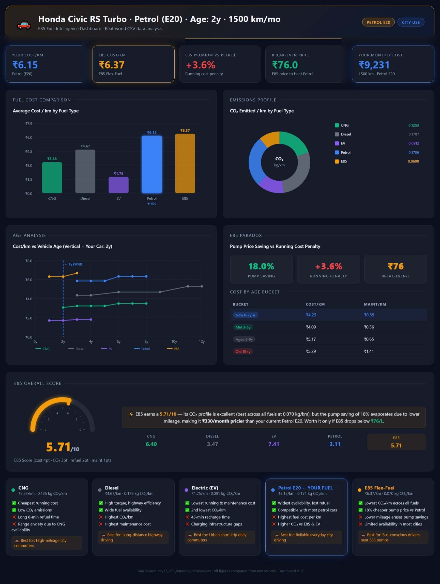
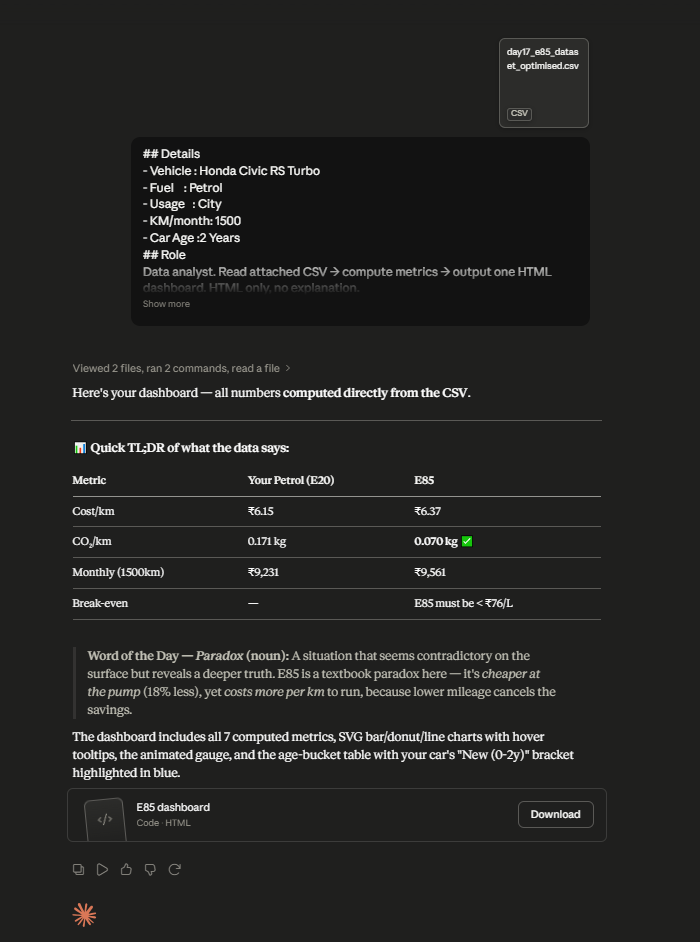

# Day 17: Vehicle Cost Analysis Dashboard with Claude

## Objective

Learn how Claude can analyze CSV datasets, calculate business metrics, generate visualizations, and build complete HTML dashboards. This exercise demonstrates how AI can be used for real-world data analytics, business intelligence, and dashboard development without manually writing code.

---

## Tools Used

* Claude AI
* CSV Dataset
* Vehicle Cost Analysis Dashboard Prompt
* HTML
* GitHub
* Markdown

---

## Folder Structure

```text
Day-17/
├── README.md
├── vehicle_cost_dashboard.html
└── screenshots/
    ├── dashboard_overview.png
    └── claude_analysis.png
```

---

## What I Did

For Day 17, I explored how Claude can function as a data analyst by processing CSV datasets, calculating business metrics, generating insights, and creating complete dashboards.

I uploaded a vehicle cost dataset along with vehicle information and used the Vehicle Cost Analysis Dashboard prompt. Claude analyzed the dataset and generated a complete HTML dashboard containing KPI cards, fuel cost comparisons, maintenance analysis, environmental impact metrics, and visual charts.

The exercise demonstrated how AI can transform raw structured data into meaningful business insights and interactive dashboards without requiring manual coding.

---

## Step 1: Prepare Vehicle Information

Before generating the dashboard, I gathered vehicle information including:

* Vehicle Model
* Fuel Type
* Vehicle Usage
* Monthly Distance
* Vehicle Age

This information provided additional context for the analysis.

---

## Step 2: Upload the CSV Dataset

Downloaded the provided CSV file and uploaded it into Claude.

The dataset contained vehicle-related operating and fuel cost information that would be used for analysis.

---

## Step 3: Configure Claude

* Opened a new conversation
* Set reasoning effort to **Low**
* Uploaded the CSV dataset
* Pasted the Vehicle Cost Analysis Dashboard prompt

---

## Step 4: Generate the Dashboard

Claude processed the dataset and generated a complete HTML dashboard containing:

* KPI Cards
* Cost Analysis
* Fuel Comparisons
* Maintenance Insights
* Environmental Impact Analysis
* SVG Charts and Visualizations

---

## Step 5: Review Business Metrics

Carefully reviewed the generated metrics including:

* Total Vehicle Costs
* Fuel Expenses
* Maintenance Costs
* Monthly Operating Costs
* Cost Efficiency Metrics
* Savings Opportunities

The dashboard organized the information into clear and easy-to-understand sections.

---

## Step 6: Analyze Fuel Economics

Examined the fuel comparison and cost analysis sections.

The dashboard highlighted:

* Fuel Cost Differences
* Operating Expenses
* Break-Even Analysis
* Cost Optimization Opportunities
* Long-Term Savings Estimates

---

## Step 7: Review Dashboard Visualizations

Analyzed the visual components generated by Claude, including:

* KPI Cards
* SVG Charts
* Cost Distribution Visualizations
* Fuel Comparison Charts
* Performance Indicators

These visualizations made it easier to identify trends and understand cost patterns.

---

## Step 8: Document the Results

Captured screenshots of:

* Complete Dashboard
* Claude Analysis Report

Saved the generated HTML dashboard and organized all files inside the Day-17 folder.

---

## Screenshots

### Vehicle Cost Analysis Dashboard



The generated dashboard presents vehicle operating costs, fuel analysis, maintenance expenses, environmental impact metrics, KPI cards, and visual charts within a single interactive interface.

### Claude Analysis Report



Claude analyzed the uploaded CSV dataset, calculated business metrics, identified cost patterns, evaluated fuel economics, and generated actionable insights used to build the dashboard.

---

## Key Findings

### Business Metrics

* AI automatically calculated important vehicle cost KPIs.
* Dashboard cards summarized operational and financial metrics.
* Data was transformed into meaningful business insights.

---

### Fuel Cost Analysis

* Compared fuel-related operating expenses.
* Highlighted cost-saving opportunities.
* Provided insights into fuel efficiency and long-term operating costs.

---

### Data Visualization

* Generated charts without manual coding.
* Improved understanding of trends and patterns.
* Presented complex data in a user-friendly format.

---

### Dashboard Automation

* Claude converted raw CSV data into a complete HTML dashboard.
* Reduced the need for manual analysis and visualization creation.
* Demonstrated AI-assisted business intelligence workflows.

---

## Key Learnings

* Claude can analyze structured CSV datasets without writing code.
* AI can generate complete dashboards from raw data.
* KPI calculations help identify meaningful business insights.
* Visualizations improve understanding of operational costs and trends.
* Structured prompts enable AI-powered business intelligence workflows.
* AI can accelerate analytics, reporting, and dashboard development.

---

## Outcome

Successfully used Claude AI to analyze a vehicle cost dataset, generate business metrics, create visualizations, and build a complete HTML dashboard. This exercise demonstrated how AI can automate data analysis, reporting, and dashboard creation while transforming raw data into actionable insights as part of the **#60DaysOfClaude** challenge.
