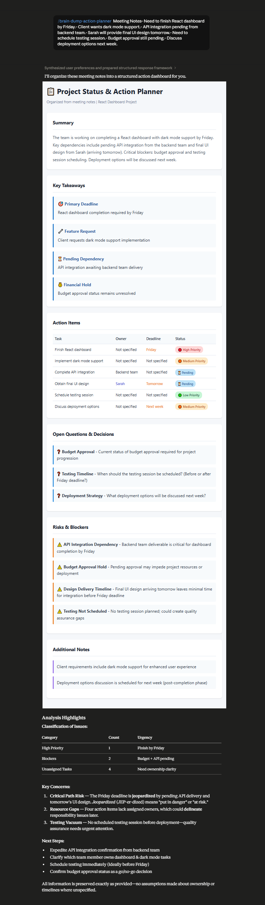
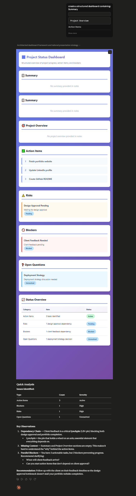

# Day 18: Brain Dump Action Planner with Claude Custom Skills

## Objective

Learn how to create a reusable Custom Skill in Claude that transforms unstructured notes into organized dashboards, action plans, risk assessments, decision logs, and project summaries.

This exercise demonstrates how AI can automate information management and project planning by converting messy notes into structured, actionable outputs.

---

## Tools Used

* Claude AI
* Claude Custom Skills
* Brain Dump Action Planner Prompt
* GitHub
* Markdown

---

## Folder Structure

```text
Day-18/
├── README.md
└── screenshots/
    ├── claude_analysis_part_1.png
    └── claude_analysis_part_2.png
```

---

## What I Did

For Day 18, I explored Claude's Custom Skills feature and learned how to convert a complex note-organization workflow into a reusable capability.

Instead of manually reviewing notes, extracting tasks, identifying risks, and organizing action items, I created a Custom Skill called **brain-dump-action-planner** that automates the entire process.

The skill transforms unstructured information into a structured dashboard containing summaries, action plans, risks, blockers, decisions, and open questions.

---

## Step 1: Explore Custom Skills

Started by understanding how Custom Skills can store reusable workflows and eliminate repetitive prompting.

The goal was to create a system that could consistently organize information across different note formats.

---

## Step 2: Create the Custom Skill

Created a new Custom Skill with the following configuration:

* Skill Name: `brain-dump-action-planner`
* Added the provided description
* Pasted the provided instructions
* Saved the skill for future use

---

## Step 3: Test the Skill

Tested the skill using various note formats:

* Meeting Notes
* Brainstorming Notes
* Project Discussions
* Class Notes
* Voice Memo Transcripts

Claude automatically transformed the information into a structured dashboard.

---

## Step 4: Generate Action Dashboard

The generated dashboard included:

* Executive Summary
* Key Insights
* Action Items
* Risks
* Blockers
* Decisions
* Open Questions
* Priority Recommendations

The output made complex information significantly easier to understand and act upon.

---

## Step 5: Review Risks & Action Plans

Carefully examined:

* Priority Tasks
* Risk Factors
* Pending Decisions
* Blocked Activities
* Follow-Up Requirements

The structured format helped highlight important information that could easily be overlooked in raw notes.

---

## Step 6: Test Reusability

Used multiple note formats and observed how the same skill consistently generated organized outputs without requiring prompt modifications.

This demonstrated the value of reusable workflows.

---

## Step 7: Document Results

Captured screenshots of:

* Custom Skill Creation
* Generated Dashboard

Saved all outputs and documentation inside the Day-18 folder.

---

## Screenshots

### Custom Skill Setup






The dashboard automatically organized notes into actionable categories including summaries, priorities, risks, blockers, and decision logs.

---

## Key Findings

### Information Management

* AI can transform unstructured notes into organized outputs.
* Complex information becomes easier to understand and manage.

---

### Project Planning

* Action items are automatically identified.
* Risks and blockers become more visible.
* Follow-up tasks are clearly organized.

---

### Productivity Improvements

* Eliminates repetitive manual organization.
* Saves time reviewing large amounts of information.
* Creates consistent outputs across different projects.

---

## Key Learnings

* Custom Skills can automate complex workflows.
* Structured outputs improve productivity and decision-making.
* AI can organize messy information into actionable plans.
* Reusable workflows reduce repetitive prompting.
* Consistent frameworks improve project management.
* Information management becomes significantly more efficient with AI assistance.

---

## Outcome

Successfully created and tested the **brain-dump-action-planner** Custom Skill in Claude. The skill transformed unstructured notes into organized dashboards containing summaries, action plans, risks, blockers, and decisions. This exercise demonstrated how reusable AI workflows can improve productivity, information management, and project planning as part of the **#60DaysOfClaude** challenge.
