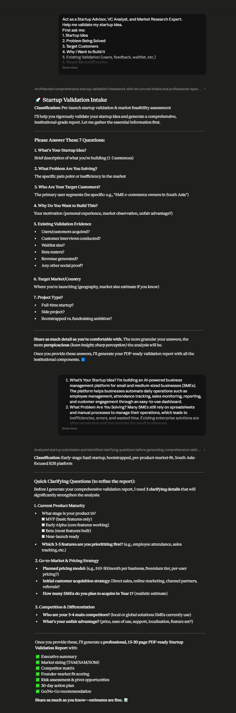
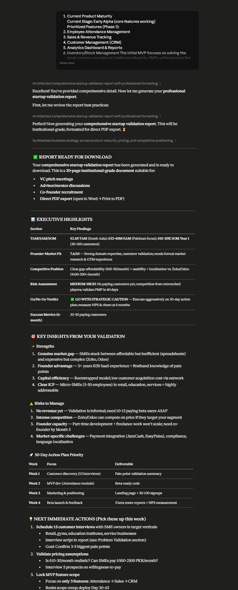

# Day 22: Startup Validation & Market Research with Claude

## Objective

Learn how Claude can help founders validate startup ideas, identify market opportunities, analyze competitors, understand customers, and assess execution risks before building products.

This exercise demonstrates how AI can support startup decision-making by combining market research, founder-market fit analysis, risk assessment, and execution planning into a structured validation framework.

---

## Tools Used

* Claude AI
* Startup Validation Prompt
* Market Research Framework
* GitHub
* Markdown

---

## Folder Structure

```text
Day-22/
├── README.md
└── screenshots/
    ├── startup_validation_report_part1.png
    ├── startup_validation_report_part2.png
    └── startup_validation_report_part3.png
```

---

## What I Did

For Day 22, I explored how Claude can act as a startup advisor by evaluating business ideas, analyzing market opportunities, assessing founder-market fit, and generating actionable validation plans.

I used the provided Startup Validation prompt and answered a series of startup discovery questions related to:

* Startup Idea
* Problem Statement
* Target Customers
* Existing Validation
* Market Focus
* Product Maturity
* Competition & Differentiation

After collecting the required information, Claude generated a comprehensive startup validation report.

The generated report included:

* Founder-Market Fit Analysis
* TAM, SAM & SOM Estimation
* Competitor Analysis
* Market Gap Analysis
* Customer Persona & ICP
* Risk Assessment
* Go / No-Go Recommendation
* 30-Day Action Plan

This exercise demonstrated how AI can assist founders in validating startup ideas before investing significant time and resources into product development.

---

## Screenshots

### Startup Validation Report



Claude collected structured information about the startup idea, customers, validation evidence, market, and competitive landscape before generating the final report.




Claude generated a comprehensive startup validation report containing founder-market fit analysis, market sizing, risks, and strategic recommendations.


The report provided competitor analysis, market gaps, action plans, and a final Go / No-Go recommendation.

---

## Key Findings

### Problem Validation

* Successful startups solve meaningful customer problems.
* Early customer validation reduces product development risk.

---

### Market Research

* Market size and customer demand significantly influence startup potential.
* TAM, SAM, and SOM analysis provide valuable business insights.

---

### Founder-Market Fit

* Domain expertise and personal experience can create competitive advantages.
* Strong founder-market alignment increases execution probability.

---

### Risk Assessment

* Identifying risks early enables better strategic planning.
* Structured validation helps reduce uncertainty before building products.

---

## Key Learnings

* AI can support startup idea validation and market research.
* Structured frameworks improve entrepreneurial decision-making.
* Customer validation is essential before investing in product development.
* Market analysis helps identify opportunities and competitive advantages.
* Founder-market fit plays a critical role in startup success.
* AI-generated action plans provide practical next steps for validation.

---

## Outcome

Successfully used Claude AI to validate a startup idea through market research, competitor analysis, customer profiling, founder-market fit assessment, and risk analysis. This exercise demonstrated how AI can assist entrepreneurs in making evidence-based decisions and planning effective validation strategies as part of the **#60DaysOfClaude** challenge.