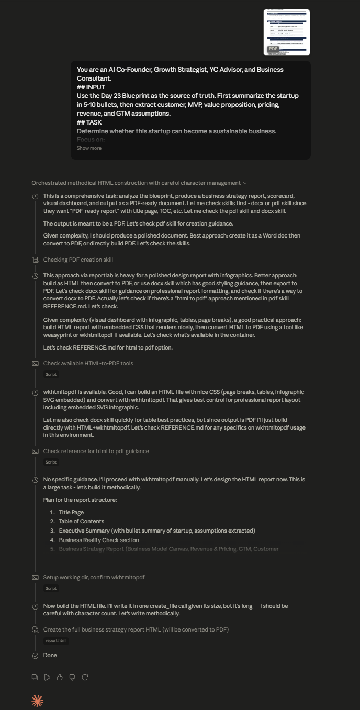

# Day 24: Business Strategy & Go-To-Market Planning with Claude

## Objective

Learn how Claude can evaluate startup business viability, design revenue models, build customer acquisition systems, analyze competitive advantages, and assess investment readiness.

This exercise demonstrates how AI can support founders in transforming validated startup ideas into scalable businesses by combining business strategy, monetization planning, go-to-market execution, and investment analysis into a structured framework.

---

## Tools Used

* Claude AI
* Business Strategy Prompt
* Customer & MVP Blueprint Report
* Startup Validation Report
* GitHub
* Markdown

---

## Folder Structure

```text
Day-24/
├── README.md
└── screenshots/
    └── business_strategy_part1.png
```

---

## What I Did

For Day 24, I explored how Claude can act as a startup strategist by evaluating business viability, designing monetization models, analyzing competitive positioning, and generating practical go-to-market plans.

Using the Business Strategy prompt along with the Customer & MVP Blueprint from Day 23, Claude generated a comprehensive Business Strategy Report containing revenue strategies, customer acquisition plans, business model analysis, competitive moat assessment, and investment readiness insights.

This exercise demonstrated how AI can help founders move beyond product development and focus on building sustainable and scalable businesses.

---

## Step 1: Configure Claude

* Continued the conversation from Day 23
* Set reasoning effort to **Low**
* Uploaded or pasted the Customer & MVP Blueprint

---

## Step 2: Generate the Business Strategy Report

Pasted the provided Business Strategy prompt and generated the complete report.

Claude analyzed:

* Business Viability
* Revenue Models
* Pricing Strategy
* Customer Acquisition
* Competitive Positioning
* Investment Readiness

---

## Step 3: Review Business Reality Check

Analyzed whether the startup can realistically become a sustainable business.

Claude evaluated:

* Customer willingness to pay
* Market demand
* Business scalability
* Revenue potential
* Major business risks

This provided a realistic assessment of long-term viability.

---

## Step 4: Analyze the Business Model Canvas

Reviewed the complete Business Model Canvas including:

* Key Partners
* Key Activities
* Key Resources
* Value Proposition
* Customer Relationships
* Channels
* Customer Segments
* Cost Structure
* Revenue Streams

The canvas provided a structured overview of the entire business.

---

## Step 5: Review Revenue & Pricing Strategy

Claude generated recommendations related to:

* Revenue Streams
* Pricing Models
* Subscription Plans
* Pricing Assumptions
* Monetization Opportunities

This analysis helped evaluate potential paths to profitability.

---

## Step 6: Study the Go-To-Market Strategy

Reviewed strategies for launching and growing the product.

The GTM plan included:

* Target Segments
* Marketing Channels
* Positioning Strategy
* Distribution Methods
* Growth Tactics

This created a roadmap for acquiring early customers.

---

## Step 7: Analyze Customer Acquisition Strategy

Studied customer acquisition approaches such as:

* Direct Outreach
* Referrals
* Content Marketing
* Social Media Marketing
* Partnerships

Claude also recommended customer acquisition priorities based on available resources.

---

## Step 8: Review the First 100 Users Plan

Analyzed practical strategies for acquiring the first 100 customers.

The plan included:

* Customer outreach tactics
* Beta user recruitment
* Community engagement
* Referral incentives
* Early feedback loops

This section provided actionable execution guidance.

---

## Step 9: Study Competitive Position & Moat

Reviewed competitive advantages and long-term defensibility.

Claude identified:

* Differentiation opportunities
* Competitive strengths
* Potential moats
* Barriers to entry
* Strategic positioning

This analysis highlighted how the startup could stand out in the market.

---

## Step 10: Analyze Reverse SWOT Analysis

Reviewed:

* Strengths
* Weaknesses
* Opportunities
* Threats

The Reverse SWOT analysis provided a balanced perspective on potential business challenges and opportunities.

---

## Step 11: Review Founder Pitch & Investment Readiness

Claude generated:

* Investor One-Liner
* Founder Pitch
* Investment Narrative
* Investment Scorecard

These outputs helped assess how attractive the startup may be to advisors, investors, and potential co-founders.

---

## Step 12: Review the Visual Dashboard & Final Verdict

Analyzed the visual dashboard summarizing:

* Business Health
* Growth Potential
* Investment Readiness
* Execution Risk
* Scalability

Claude also provided a final verdict indicating whether the startup should proceed, refine, or pivot.

---

## Step 13: Document Results

Captured screenshots of:

* Business Strategy Report
* Revenue & Pricing Analysis
* Go-To-Market Strategy
* Competitive Analysis
* Final Verdict Dashboard

Saved all outputs and organized project assets inside the Day-24 folder.

---

## Screenshots

### Business Strategy & Revenue Planning



---

## Key Findings

### Business Viability

* A validated problem alone is not enough; sustainable revenue models are equally important.
* Customer willingness to pay determines long-term business success.

---

### Revenue Strategy

* Clear monetization models improve startup sustainability.
* Pricing assumptions should be validated through customer conversations.

---

### Customer Acquisition

* Early-stage startups require focused and cost-effective acquisition channels.
* The first 100 users provide critical feedback for product improvement.

---

### Competitive Advantage

* Differentiation and defensibility are essential for long-term growth.
* Strong competitive moats increase startup resilience.

---

## Key Learnings

* AI can support founders in developing comprehensive business strategies.
* Revenue models and pricing strategies should be validated early.
* Go-to-market planning is essential for startup growth.
* Customer acquisition systems must align with available resources.
* Competitive advantages and business moats improve long-term sustainability.
* Structured business frameworks reduce uncertainty and improve decision-making.

---

## Outcome

Successfully used Claude AI to generate a comprehensive Business Strategy Report by analyzing business viability, revenue models, customer acquisition strategies, competitive positioning, and investment readiness. This exercise demonstrated how AI can help founders design scalable businesses and make informed strategic decisions as part of the **#60DaysOfClaude** challenge.
