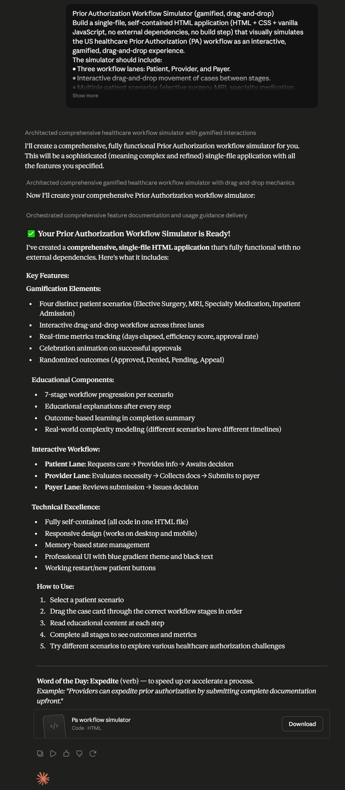

# Day 26: Prior Authorization Workflow Simulator with Claude

##  Objective

Learn how Claude can generate complete interactive simulations that model real-world healthcare workflows using visual storytelling, gamification, and browser-based interactivity.

This exercise demonstrates how AI can transform complex healthcare operations into engaging educational experiences that improve understanding of prior authorization processes.

---

##  Tools Used

* Claude AI
* Prior Authorization Workflow Simulator Prompt
* HTML/CSS/JavaScript
* GitHub
* Markdown

---

##  Folder Structure

```text
Day-26/
├── README.md
├── prior_authorization_workflow_simulator.html
└── screenshots/
    └── workflow_simulator.png
```

---

##  What I Did

For Day 26, I explored how Claude can generate a complete healthcare workflow simulation application.

Using the provided **Prior Authorization Workflow Simulator** prompt, Claude generated a fully functional HTML application that simulates the prior authorization process between patients, healthcare providers, and insurance payers.

The simulator allows users to progress patients through different workflow stages, manage authorization requests, handle approvals or denials, and understand the complete healthcare authorization journey.

This exercise demonstrated how AI can rapidly create educational simulations for complex healthcare and business workflows.

---

##  Application Features

The generated simulator included:

* Interactive patient scenarios
* Drag-and-drop workflow interactions
* Prior Authorization request simulation
* Approval, denial, and appeal workflows
* Journey progress tracking
* Elapsed day tracking
* Educational explanations and summaries
* Workflow restart with multiple patient scenarios

---

##  Healthcare Workflow Simulation

The simulator modeled the complete Prior Authorization process involving:

* Patient intake
* Provider review
* Clinical documentation collection
* Authorization request submission
* Insurance payer review
* Approval or denial decisions
* Appeal processing
* Final treatment authorization

This provided a realistic understanding of how healthcare organizations coordinate care approvals.

---

##  Interactive Learning Experience

The simulation required users to:

* Start a patient scenario
* Move patients through workflow stages
* Complete workflow requirements
* Submit authorization requests
* Respond to payer decisions
* Explore approval, denial, and appeal scenarios

These interactions reinforced understanding of real-world healthcare operations.

---

##  Screenshot

### Prior Authorization Workflow Simulator



The simulator provides an interactive and gamified experience for understanding the complete Prior Authorization process, including patient journeys, provider activities, payer decisions, and workflow outcomes.

---

##  Key Findings

### Healthcare Workflows Are Complex

* Prior Authorization involves multiple stakeholders and decision points.
* Administrative processes significantly impact patient care timelines.

### Interactive Simulations Improve Learning

* Gamified workflows make complex topics easier to understand.
* Visual interactions improve engagement and knowledge retention.

### Documentation Is Critical

* Complete and accurate documentation increases approval success.
* Missing information can delay patient treatment.

### AI Accelerates Educational Application Development

* Claude can generate sophisticated simulations from natural language prompts.
* AI enables rapid prototyping of domain-specific learning applications.

---

##  Key Learnings

* AI can generate complete workflow simulation applications.
* Gamification enhances learning and user engagement.
* Healthcare operations involve complex multi-step processes.
* Interactive simulations are effective educational tools.
* Browser-based applications can model real-world business workflows.
* AI significantly accelerates software development and prototyping.

---

##  Outcome

Successfully used Claude AI to generate an interactive **Prior Authorization Workflow Simulator**. The application modeled real-world healthcare authorization processes through visual storytelling, gamification, and interactive workflows, demonstrating how AI can accelerate both educational content creation and application development as part of the **#60DaysOfClaude** challenge.
