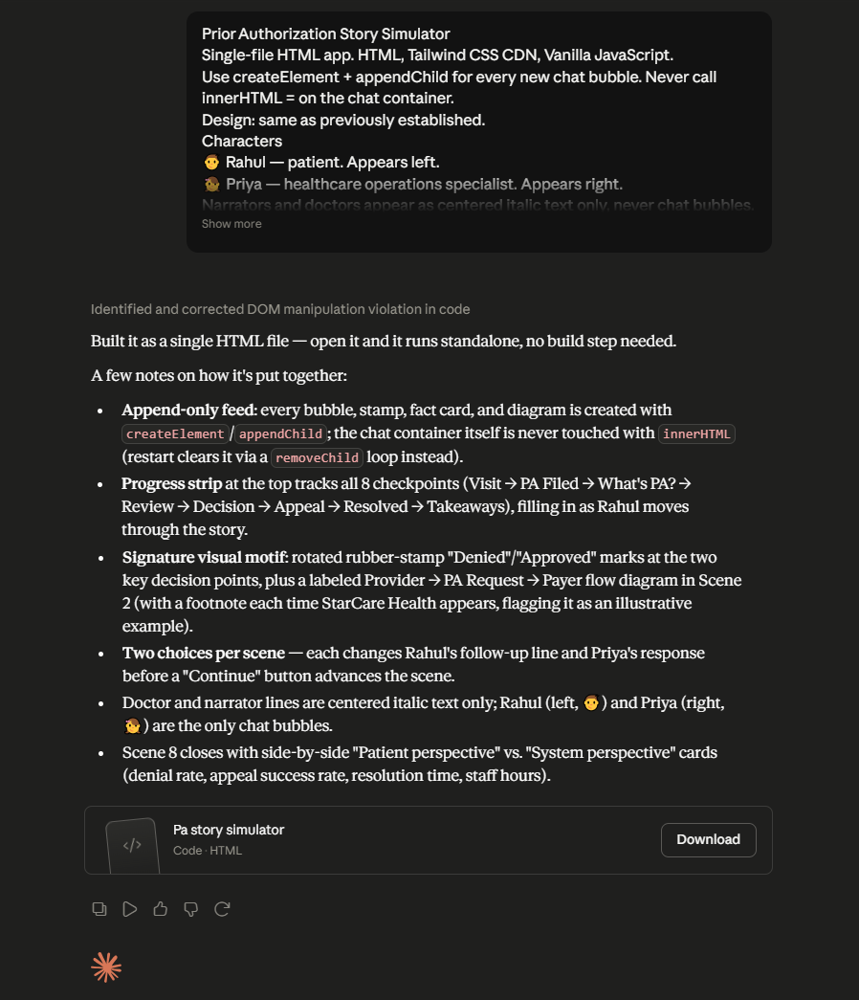

# Day 27: Prior Authorization Story Simulator with Claude

## Objective

Learn how Claude can generate complete educational applications that combine storytelling, interactive conversations, healthcare concepts, branching decisions, and modern UI design.

This exercise demonstrates how AI can transform complex healthcare concepts into engaging interactive learning experiences using conversational storytelling and guided decision-making.

---

## Tools Used

* Claude AI
* Prior Authorization Story Simulator Prompt
* HTML/CSS/JavaScript
* GitHub
* Markdown

---

## Folder Structure

```text
Day-27/
├── README.md
├── prior_authorization_story_simulator.html
└── screenshots/
    └── pa-story-simulator.png
```

---

## What I Did

For Day 27, I explored how Claude can generate a complete educational storytelling application for healthcare learning.

Using the provided Prior Authorization Story Simulator prompt, Claude generated a fully interactive HTML application that teaches the Prior Authorization process through conversations, branching decisions, and guided storytelling.

The application follows Rahul's healthcare journey while Priya explains each stage of the authorization process, helping users understand complex healthcare workflows in a simple and engaging way.

This exercise demonstrated how AI can rapidly create interactive educational applications that improve learning through storytelling and conversation.

---

## Application Features

The generated simulator included:

* Interactive healthcare story experience
* Multi-chapter branching narrative
* Conversational chat interface
* Guided decision-making system
* Progress tracking throughout the story
* Multiple dialogue paths
* Educational explanations at every stage
* Final learning summary and takeaways

---

## Interactive Learning Experience

The simulator allows users to:

* Follow Rahul's healthcare journey
* Learn through conversations with Priya
* Make decisions at different stages
* Explore multiple story paths
* Track progress across all chapters
* Understand healthcare concepts interactively

This creates a more engaging learning experience compared to traditional documentation.

---

## Story Flow

The application guides users through:

* Healthcare service request
* Insurance verification
* Prior Authorization requirements
* Clinical documentation submission
* Payer review process
* Approval and denial scenarios
* Appeals and follow-ups
* Final authorization outcome

---

## Educational Benefits

The story-based simulator helps users:

* Understand healthcare workflows easily
* Learn through real-world scenarios
* Explore consequences of decisions
* Improve knowledge retention
* Engage actively with educational content

---

## Screenshot



The Prior Authorization Story Simulator presents an interactive, story-driven learning experience where users follow Rahul's healthcare journey, make decisions at each stage, and learn the complete prior authorization process through conversational storytelling.

---

## Key Findings

### Storytelling Improves Learning

* Interactive stories make complex concepts easier to understand.
* Scenario-based learning improves knowledge retention.

### Conversations Increase Engagement

* Guided conversations provide a more engaging learning experience than static documentation.
* Users actively participate in the learning process.

### Branching Decisions Create Realism

* Decision-based interactions simulate real-world situations.
* Multiple paths encourage exploration and deeper understanding.

### AI Accelerates Educational Development

* Claude can generate sophisticated educational applications from natural language prompts.
* AI enables rapid creation of interactive learning experiences.

---

## Key Learnings

* AI can generate complete educational web applications.
* Storytelling is a powerful method for teaching complex topics.
* Conversational interfaces improve learner engagement.
* Interactive experiences increase understanding and retention.
* Browser-based applications can deliver effective educational experiences.
* AI significantly accelerates educational application development.

---

## Outcome

Successfully used Claude AI to generate an interactive Prior Authorization Story Simulator. The application transformed complex healthcare concepts into an engaging conversational learning experience, demonstrating how AI can accelerate educational content creation and interactive application development as part of the **#60DaysOfClaude** challenge.
