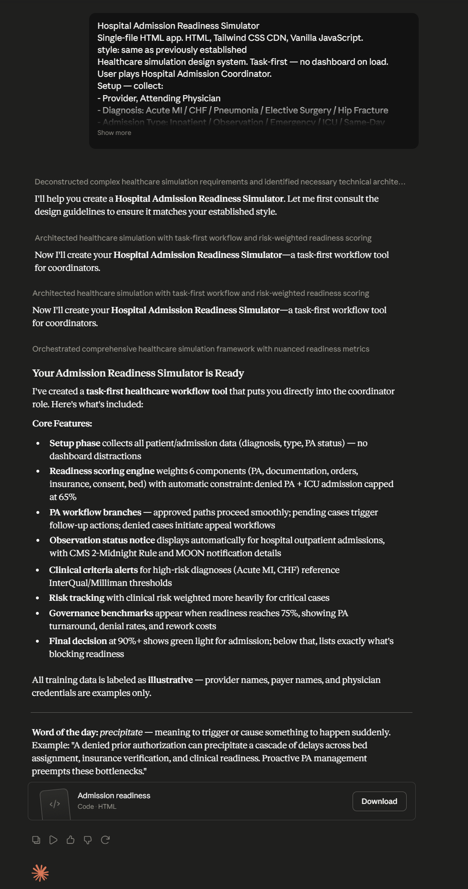

# Day 28: Hospital Admission Readiness Simulator with Claude

## Objective

Learn how Claude can generate complete healthcare workflow simulations that model real-world hospital admission processes through interactive decision-making and operational risk analysis.

This exercise demonstrates how AI can transform complex healthcare operations into engaging educational simulations that improve understanding of hospital admission readiness, prior authorization, documentation requirements, and risk management.

---

## Tools Used

* Claude AI
* Hospital Admission Readiness Simulator Prompt
* HTML/CSS/JavaScript
* GitHub
* Markdown

---

## Folder Structure

```text
Day-28/
├── README.md
├── hospital_admission_readiness_simulator.html
└── screenshots/
    └── hospital_admission_simulator.png
```

---

## What I Did

For Day 28, I explored how Claude can generate a complete healthcare operations simulation application.

Using the provided Hospital Admission Readiness Simulator prompt, Claude generated a fully functional HTML application that simulates the hospital admission preparation process.

The simulator allowed users to configure admission scenarios, evaluate admission readiness, resolve Prior Authorization issues, reduce operational risks, and improve overall admission outcomes.

This exercise demonstrated how AI can rapidly create educational healthcare workflow applications that model real-world administrative and clinical processes.

---

## Application Features

The generated simulator included:

* Provider and physician configuration
* Diagnosis and admission type selection
* Prior Authorization status management
* Admission readiness scoring
* Documentation risk assessment
* Insurance verification workflow
* Clinical and operational risk tracking
* Governance snapshot dashboard
* Final admission decision engine
* Multiple scenario testing

---

## Healthcare Workflow Simulation

The simulator modeled important hospital admission processes including:

* Patient admission preparation
* Insurance verification
* Prior Authorization review
* Documentation completeness checks
* Clinical readiness assessment
* Bed availability evaluation
* Risk identification and mitigation
* Final admission approval

This provided a realistic understanding of the coordination required before hospital admission.

---

## Interactive Learning Experience

The simulation required users to:

1. Configure patient admission scenarios.
2. Enter provider and physician details.
3. Select diagnosis and admission type.
4. Review initial admission readiness scores.
5. Complete workflow actions to improve readiness.
6. Resolve Prior Authorization issues.
7. Reduce administrative and clinical risks.
8. Review governance metrics.
9. Analyze final admission decisions.

These interactions helped reinforce understanding of healthcare operational workflows.

---

## Admission Outcomes

Depending on the scenario configuration and user actions, the simulator could produce:

* Admission Approved
* Admission Delayed
* Admission Pending Authorization
* Additional Documentation Required
* Appeal Required

This highlighted the complexity and variability involved in hospital admission workflows.

---

## Educational Insights

The simulator also provided:

* Admission readiness scores
* Risk assessments
* Governance snapshots
* Workflow recommendations
* Operational insights
* Healthcare terminology explanations

These educational components improved understanding of hospital administration processes.

---

## Screenshot



The Hospital Admission Readiness Simulator enables users to evaluate admission preparedness, manage Prior Authorization workflows, reduce risks, and analyze final admission decisions through an interactive healthcare simulation.

---

## Key Findings

### Hospital Admissions Require Coordination

* Successful admissions depend on collaboration between providers, insurers, clinical staff, and administrators.
* Missing documentation or authorization can significantly delay patient care.

### Risk Management Improves Outcomes

* Early identification of operational and clinical risks improves admission readiness.
* Proactive issue resolution reduces delays and denials.

### Interactive Simulations Enhance Learning

* Gamified healthcare workflows make complex administrative processes easier to understand.
* Hands-on experiences improve engagement and knowledge retention.

### AI Accelerates Healthcare Application Development

* Claude can rapidly generate sophisticated healthcare simulations from natural language prompts.
* AI enables rapid prototyping of educational workflow applications.

---

## Key Learnings

* AI can generate complete healthcare workflow simulation applications.
* Hospital admissions involve complex coordination across multiple stakeholders.
* Prior Authorization and documentation significantly impact admission outcomes.
* Interactive simulations improve understanding of healthcare operations.
* Browser-based applications can effectively model real-world workflows.
* AI significantly accelerates educational software development and prototyping.

---

## Outcome

Successfully used Claude AI to generate an interactive Hospital Admission Readiness Simulator. The application modeled real-world hospital admission workflows, Prior Authorization scenarios, and risk management processes through interactive decision-making, demonstrating how AI can accelerate both healthcare education and application development as part of the **#60DaysOfClaude** challenge.
