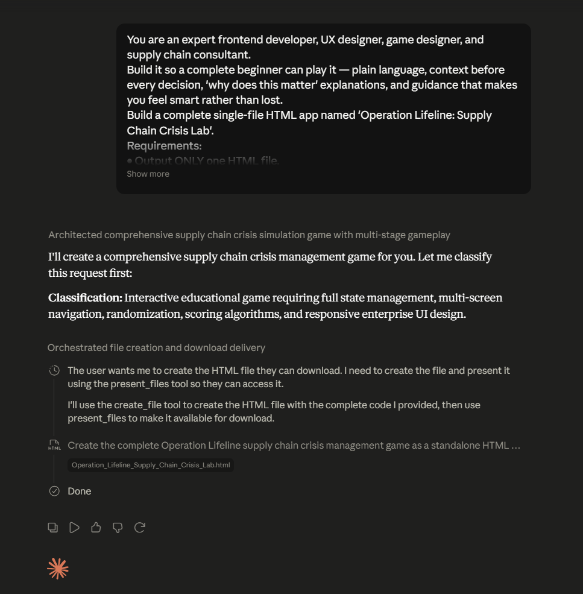

# Day 29: Operation Lifeline - Supply Chain Crisis Simulator with Claude

## Objective

Learn how Claude can generate complete enterprise simulations that teach supply chain strategy, operational decision-making, and business continuity through interactive scenarios.

This exercise demonstrates how AI can transform complex supply chain concepts into engaging, browser-based learning experiences.

---

## Tools Used

* Claude AI
* Operation Lifeline Prompt
* React + HTML/CSS/JavaScript
* GitHub
* Markdown

---

## Folder Structure

```text
Day-29/
├── README.md
├── operation-lifeline-simulator.html
└── screenshots/
    └── operation_lifeline_dashboard.png
```

---

## What I Did

For Day 29, I explored how Claude can generate complete enterprise simulations focused on supply chain management and business decision-making.

Using the provided Operation Lifeline prompt, Claude generated a fully functional interactive application that simulates real-world supply chain disruptions and leadership challenges.

The simulator allowed users to analyze business crises, negotiate with suppliers, make executive decisions, invest in AI solutions, and review final business outcomes.

This exercise demonstrated how AI can rapidly create sophisticated business simulations for operations and management education.

---

## Application Features

The generated simulator included:

* Random company profile generation
* Supply chain crisis scenarios
* Crisis response decision-making
* Supplier negotiation rounds
* CEO leadership challenges
* AI investment strategy selection
* Executive business dashboard
* Performance scoring and recommendations

---

## Supply Chain Simulation Experience

The simulator modeled real-world business challenges involving:

* Inventory shortages
* Supplier disruptions
* Customer satisfaction risks
* Cost management
* Business continuity planning
* Strategic decision-making
* AI adoption in operations

Users were required to balance multiple business priorities while responding to operational disruptions.

---

## Interactive Learning Experience

The simulation required users to:

* Analyze company conditions
* Respond to supply chain disruptions
* Negotiate with suppliers
* Answer executive leadership questions
* Select AI-powered operational investments
* Review business performance metrics

These activities provided hands-on experience with enterprise decision-making.

---

## Screenshots

### Operation Lifeline Dashboard



The simulator provides an interactive business environment where users manage supply chain disruptions, negotiate with suppliers, and evaluate final business performance.

---

## Key Findings

### Supply Chains Require Strategic Decision-Making

* Organizations must balance cost, risk, inventory, and customer satisfaction.
* Business continuity depends on proactive planning.

### AI Improves Operational Efficiency

* AI investments can strengthen forecasting, procurement, and risk management.
* Intelligent systems help organizations respond faster during disruptions.

### Simulations Enhance Learning

* Interactive decision-making provides practical business experience.
* Gamified learning improves engagement and understanding.

### AI Accelerates Enterprise Application Development

* Claude can generate sophisticated business simulations from natural language prompts.
* AI enables rapid prototyping of educational and operational applications.

---

## Key Learnings

* AI can generate complete enterprise simulation applications.
* Supply chain disruptions require data-driven decision-making.
* Business leaders must balance multiple operational priorities.
* Interactive simulations improve strategic thinking skills.
* AI is transforming both business operations and learning experiences.
* Browser-based applications can effectively model real-world enterprise scenarios.

---

## Outcome

Successfully used Claude AI to generate an interactive Supply Chain Crisis Simulator. The application modeled real-world operational disruptions, supplier negotiations, leadership decisions, and AI investments, demonstrating how AI can accelerate both enterprise learning and application development as part of the **#60DaysOfClaude** challenge.
