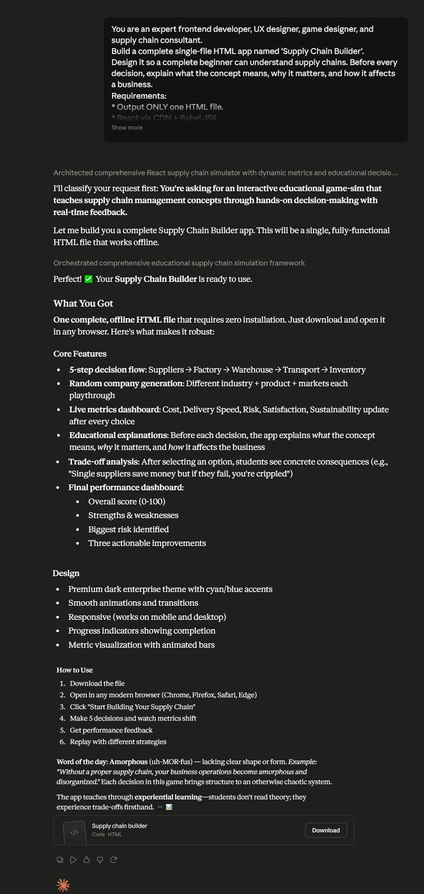

# Day 30: Supply Chain Optimizer with Claude

## Objective

Learn how Claude can generate complete enterprise simulation applications that teach supply chain optimization through interactive business decision-making.

This exercise demonstrates how AI can transform complex logistics and operations concepts into engaging browser-based learning experiences.

---

## Tools Used

* Claude AI
* Supply Chain Optimizer Prompt
* React + HTML/CSS/JavaScript
* GitHub
* Markdown

---

## Folder Structure

```text
Day-30/
├── README.md
├── supply_chain_optimizer.html
└── screenshots/
    └── supply_chain_optimizer_dashboard.png
```

---

## What I Did

For Day 30, I explored how Claude can generate a complete enterprise simulation focused on supply chain optimization.

Using the provided Supply Chain Optimizer prompt, Claude generated a fully functional browser application that simulates real-world logistics and operational decision-making.

The simulator allowed users to optimize sourcing, factory locations, warehouse strategies, transportation methods, and inventory planning while tracking business performance in real time.

This exercise demonstrated how AI can rapidly build interactive enterprise learning applications without writing the application manually.

---

## Application Features

The generated simulator included:

* Random company profile generation
* Supplier strategy selection
* Factory location planning
* Warehouse optimization
* Transportation strategy selection
* Inventory management decisions
* Live business metric updates
* Final optimization dashboard
* Overall Supply Chain Score
* Strengths, weaknesses, risks, and recommendations

---

## Supply Chain Optimization Experience

The simulator modeled several key operational decisions, including:

* Supplier sourcing strategy
* Manufacturing location
* Warehouse distribution
* Transportation planning
* Inventory optimization
* Cost and efficiency balancing
* Sustainability considerations
* Customer satisfaction improvements

Each decision dynamically affected business performance metrics.

---

## Interactive Learning Experience

The simulation required users to:

* Review a company profile
* Make supply chain optimization decisions
* Compare business trade-offs
* Monitor live performance metrics
* Analyze the final optimization dashboard
* Identify operational strengths and risks

These activities provided practical insights into enterprise operations.

---

## Screenshots

### Supply Chain Optimizer Dashboard



The dashboard displays optimization decisions, live business metrics, overall supply chain performance, and improvement recommendations.

---

## Key Findings

### Optimization Is Continuous

* Small operational improvements can significantly improve business performance.
* Every supply chain decision involves balancing multiple trade-offs.

### Business Decisions Are Connected

* Supplier, warehouse, transportation, and inventory strategies directly impact cost, speed, and customer satisfaction.
* Optimizing one area often influences the entire supply chain.

### Interactive Simulations Improve Learning

* Hands-on decision-making makes enterprise concepts easier to understand.
* Visual dashboards help explain operational performance.

### AI Accelerates Enterprise Application Development

* Claude can generate sophisticated business simulations from natural language prompts.
* AI enables rapid prototyping of educational business applications.

---

## Key Learnings

* AI can generate complete enterprise simulation applications.
* Supply chain optimization requires balancing cost, speed, risk, and customer experience.
* Interactive simulations improve strategic decision-making skills.
* Business dashboards provide valuable operational insights.
* AI accelerates software development and enterprise education.
* Browser-based applications can effectively model real-world logistics systems.

---

## Outcome

Successfully used Claude AI to generate an interactive Supply Chain Optimizer. The application simulated sourcing, manufacturing, warehousing, transportation, inventory management, and business optimization, demonstrating how AI can accelerate enterprise learning and software development as part of the **#60DaysOfClaude** challenge.
