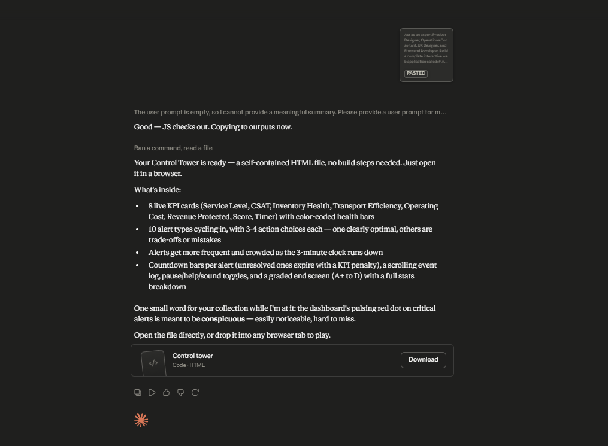

# Day 31: AI Supply Chain Control Tower with Claude

## Objective

Learn how Claude can generate enterprise-grade operational dashboards that simulate real-time Supply Chain Control Towers.

This project demonstrates how AI can build interactive business applications that teach operational decision-making, KPI monitoring, incident management, and supply chain optimization through realistic simulations.

---

## Tools Used

- Claude AI
- AI Supply Chain Control Tower Prompt
- HTML
- CSS
- JavaScript
- GitHub
- Markdown

---

## Folder Structure

```text
Day-31/
├── README.md
├── control_tower.html
└── screenshots/
    └── control_tower_dashboard.png
```

---

## What I Did

For Day 31, I explored how Claude can generate a complete Supply Chain Control Tower simulation.

Using the provided prompt, Claude created a browser-based dashboard that simulates real-time supply chain operations. The application presents operational alerts, business KPIs, and decision-making scenarios where users must prioritize incidents and choose the best corrective actions.

This exercise demonstrated how AI can rapidly generate enterprise-style business applications that combine analytics, simulations, and interactive learning.

---

## Application Features

The generated simulator includes:

- Real-time operational alerts
- Interactive incident prioritization
- Corrective action selection
- Live KPI dashboard
- Supply chain performance monitoring
- Inventory and logistics tracking
- Business impact visualization
- Final operational performance report

---

## Supply Chain Control Tower Simulation

The simulator models key enterprise operations, including:

- Logistics monitoring
- Inventory management
- Supplier performance
- Transportation tracking
- Warehouse operations
- Operational risk management
- Customer service impact

Users make operational decisions while balancing business objectives and maintaining overall supply chain performance.

---

## Interactive Learning Experience

The simulation allows users to:

- Monitor incoming alerts
- Prioritize critical incidents
- Select corrective actions
- Track KPI changes in real time
- Balance operational trade-offs
- Improve overall performance

This hands-on experience demonstrates how enterprise teams manage complex supply chain operations.

---

## Key Learnings

- AI can generate complete enterprise dashboard applications.
- Supply Chain Control Towers improve operational visibility.
- Business decisions directly impact KPIs and customer satisfaction.
- Interactive simulations simplify complex enterprise workflows.
- AI accelerates rapid application development and business education.

---

## Screenshots

### Supply Chain Control Tower Dashboard



The interactive dashboard displays operational alerts, business KPIs, decision options, and real-time performance metrics throughout the simulation.

---

## Outcome

Successfully built an interactive **AI Supply Chain Control Tower** using Claude. The application demonstrates how AI can create enterprise-grade simulations that improve operational decision-making, KPI management, and supply chain visibility as part of the **#60DaysOfClaude** challenge.