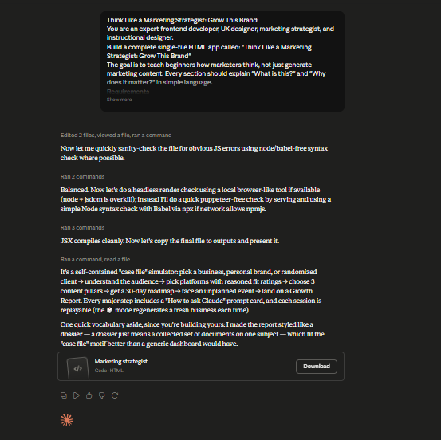

# Day 32: Marketing Strategy Simulator with Claude

## Objective

Learn how Claude can generate interactive marketing strategy simulations that help users understand audience research, platform selection, content planning, and business growth through real-world decision making.

This exercise demonstrates how AI can transform marketing education into an engaging, browser-based learning experience.

---

## Tools Used

- Claude AI
- Marketing Strategy Simulator Prompt
- HTML/CSS/JavaScript
- GitHub
- Markdown

---

## Folder Structure

```text
Day-32/
├── README.md
├── marketing_strategy_simulator.html
└── screenshots/
    └── marketing-strategy-simulator.png
```

---

## What I Did

For Day 32, I explored how Claude can generate a complete Marketing Strategy Simulator that teaches marketing concepts through interactive business scenarios.

Using the provided prompt, Claude generated a browser-based application that guides users through audience research, platform selection, content planning, growth strategy, and marketing decision-making.

Rather than simply explaining marketing concepts, the simulator allows users to make strategic decisions and instantly understand their business impact.

---

## Application Features

The generated simulator included:

- Business & Personal Brand selection
- Audience research and customer analysis
- Marketing platform recommendations
- Content pillar selection
- 30-Day Marketing Roadmap
- Marketing event simulation
- Business Growth Report
- Reusable Claude prompts for every stage

---

## Marketing Strategy Simulation

The simulator walks users through the complete marketing planning process, including:

- Understanding the target audience
- Selecting the right marketing channels
- Creating content pillars
- Building a long-term growth strategy
- Responding to real-world marketing challenges
- Reviewing overall marketing performance

---

## Interactive Learning Experience

The application enables users to:

- Analyze customer personas
- Compare marketing platforms
- Choose content strategies
- Generate marketing roadmaps
- Handle unexpected marketing events
- Review final growth recommendations

These activities provide a practical understanding of modern marketing strategy.

---

## Screenshots

### Marketing Strategy Simulator



The application provides an interactive environment for planning marketing strategies, selecting platforms, creating content plans, and analyzing business growth opportunities.

---

## Key Findings

### Audience Comes First

Understanding customer needs is the foundation of every successful marketing strategy.

### Strategy Beats Random Content

Choosing the right platforms and creating focused content pillars leads to more sustainable business growth.

### Interactive Learning Improves Understanding

Hands-on simulations make marketing concepts easier to understand than traditional documentation.

### AI Accelerates Marketing Planning

Claude can generate complete educational applications that simplify complex marketing workflows.

---

## Key Learnings

- AI can generate complete interactive marketing applications.
- Audience research should guide every marketing decision.
- Platform selection depends on business goals and customer behavior.
- Content pillars create consistency and long-term growth.
- Interactive simulations improve strategic thinking.
- AI significantly accelerates software development and marketing education.

---

## Outcome

Successfully used Claude AI to generate an interactive Marketing Strategy Simulator that teaches audience analysis, platform strategy, content planning, and growth planning through hands-on decision making. This project demonstrates how AI can simplify complex marketing concepts while accelerating educational application development as part of the **#60DaysOfClaude** challenge.