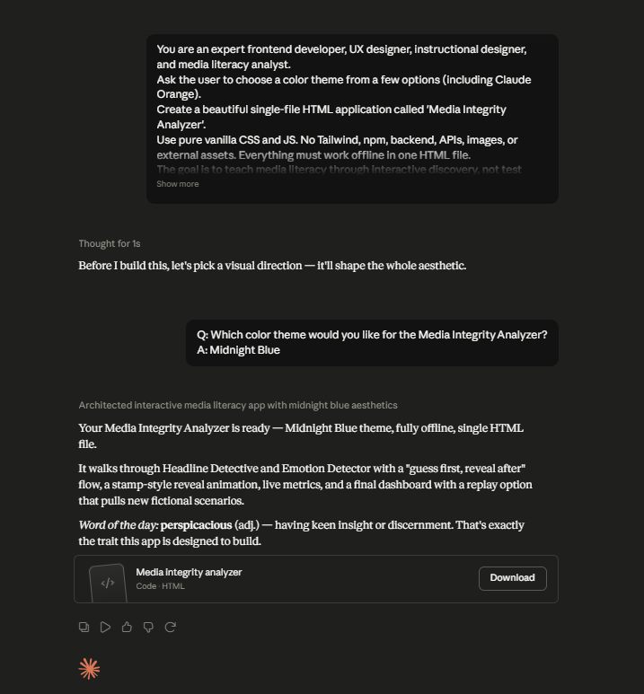

# Day 33 – Media Integrity Analyzer

## Overview

Today I built a **Media Integrity Analyzer** using **Claude** as part of the **#60DaysOfClaude Challenge**.

This interactive HTML application teaches media literacy by helping users identify misleading headlines, emotional manipulation, and biased language through hands-on learning instead of passive reading.

---

## What I Learned

- How headlines influence readers' perceptions.
- How emotional language can manipulate opinions.
- The importance of evaluating information critically before accepting conclusions.
- How AI can generate engaging educational applications that promote critical thinking.

---

## Features

- Headline Detective Challenge
- Headline Analysis & Neutral Rewrite
- Emotion Detector Challenge
- Emotional Manipulation Analysis
- Live Media Integrity Metrics
- Interactive Dashboard
- Multiple Theme Support
- Randomized Learning Scenarios

---

## Technologies Used

- HTML5
- CSS3
- JavaScript
- Claude AI

---

## Screenshot

### Media Integrity Analyzer



The application guides users through interactive exercises to identify misleading headlines, detect emotional language, analyze media bias, and improve critical thinking skills using real-world examples.

---

## Key Learnings

- Headlines significantly shape first impressions.
- Emotional wording can influence decision-making.
- Critical thinking helps reduce misinformation.
- Interactive learning improves understanding more effectively than static content.
- AI can rapidly generate educational tools for digital literacy.

---

## Repository Structure

```
Day33/
│
├── media-integrity-analyzer.html
├── readme.md
└── screenshots/
    └── media-integrity-analyzer.png
```

---

## Conclusion

Day 33 demonstrated how AI can simplify media literacy education by transforming complex concepts into interactive learning experiences that encourage critical thinking and responsible information consumption.