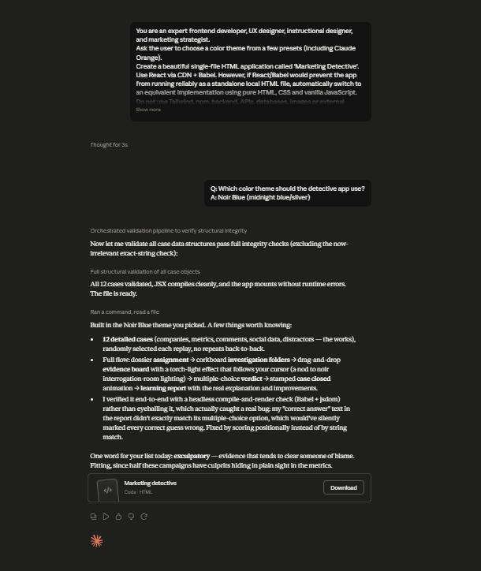

# Day 34: Marketing Detective Simulator with Claude

## Objective

Learn how Claude can generate complete educational simulation applications that teach marketing strategy through interactive investigation and evidence-based decision-making.

This exercise demonstrates how AI can transform complex marketing concepts into engaging browser-based learning experiences.

---

## Tools Used

* Claude AI
* Marketing Detective Prompt
* React + HTML/CSS/JavaScript
* GitHub
* Markdown

---

## Folder Structure

```text
Day-34/
├── README.md
├── marketing_detective_simulator.html
└── screenshots/
    └── marketing_detective.png
```

---

## What I Did

For Day 34, I explored how Claude can generate a complete interactive marketing investigation simulator.

Using the provided Marketing Detective prompt, Claude generated a fully functional browser application that teaches marketing strategy through real-world campaign investigations.

The simulator allows users to examine campaign evidence, organize marketing clues, identify the primary cause of campaign failure, and learn the reasoning behind successful marketing decisions.

This exercise demonstrated how AI can rapidly build interactive educational applications that make marketing concepts easier to understand through hands-on investigation.

---

## Application Features

The generated simulator included:

* Interactive marketing investigation board
* Campaign performance analysis
* Customer behavior insights
* Drag-and-drop evidence organization
* Marketing metrics dashboard
* Investigation verdict system
* Expert explanation and feedback
* Marketing Learning Report
* Multiple randomized marketing cases
* Theme selection

---

## Marketing Investigation Experience

The simulator modeled several real-world marketing activities, including:

* Investigating campaign performance
* Analyzing customer behavior
* Reviewing marketing metrics
* Organizing evidence cards
* Identifying campaign mistakes
* Evaluating business decisions
* Learning from expert explanations
* Reviewing the final learning report

Each investigation helped users understand how data-driven decisions improve marketing success.

---

## Interactive Learning Experience

The simulation required users to:

* Accept a marketing investigation
* Analyze campaign evidence
* Organize investigation cards
* Identify the primary marketing mistake
* Review expert explanations
* Study the Marketing Learning Report
* Replay multiple randomized investigations

These activities provided practical insights into marketing analysis and strategic decision-making.

---

## Screenshots

### Marketing Detective



The dashboard displays campaign evidence, investigation tools, marketing metrics, expert analysis, and the final learning report.

---

## Key Findings

### Marketing Requires Evidence

* Successful marketing decisions should be based on data instead of assumptions.
* Customer behavior provides valuable insights into campaign performance.

### Every Marketing Decision Matters

* Audience targeting, messaging, and campaign execution all influence business success.
* Small improvements can significantly improve overall campaign performance.

### Interactive Simulations Improve Learning

* Solving marketing investigations makes complex concepts easier to understand.
* Hands-on analysis builds stronger critical thinking skills than traditional learning methods.

### AI Accelerates Educational Application Development

* Claude can generate sophisticated educational simulations from natural language prompts.
* AI enables rapid development of interactive business learning applications.

---

## Key Learnings

* AI can generate complete marketing simulation applications.
* Marketing strategy should be driven by evidence and customer insights.
* Interactive investigations improve analytical thinking.
* Business dashboards help visualize marketing performance.
* AI accelerates software development and business education.
* Browser-based applications can effectively simulate real-world marketing scenarios.

---

## Outcome

Successfully used Claude AI to generate an interactive Marketing Detective Simulator. The application simulated campaign investigations, customer analysis, evidence organization, and strategic decision-making, demonstrating how AI can accelerate marketing education and software development as part of the **#60DaysOfClaude** challenge.