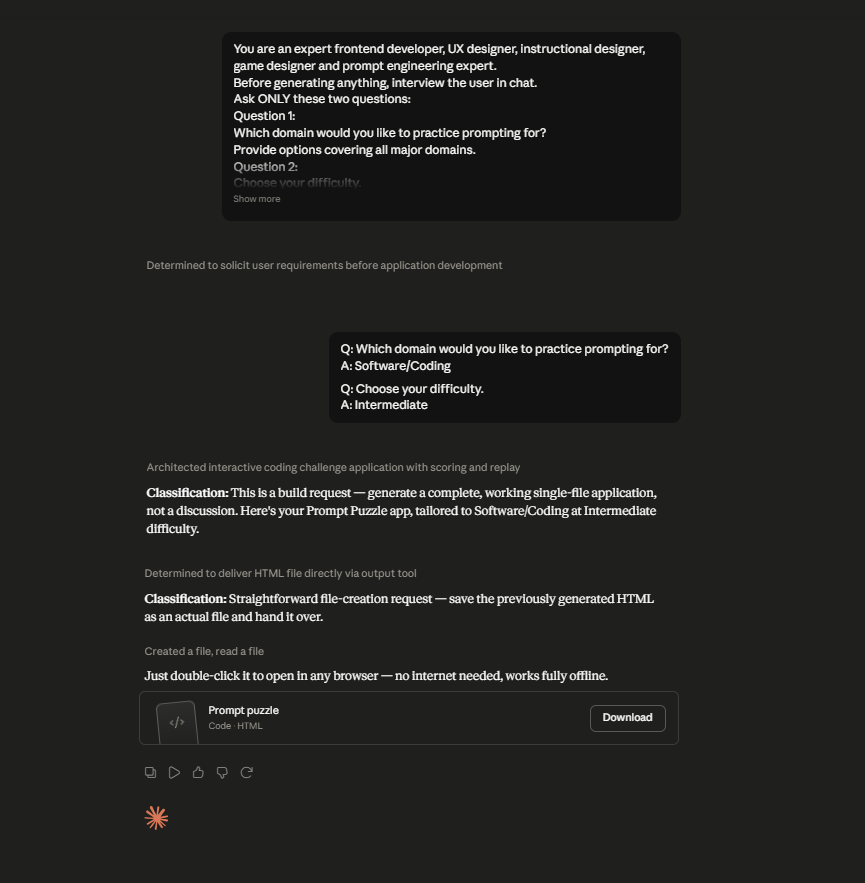

# Day 35: Prompt Puzzle with Claude

## Objective

Learn how Claude can generate complete educational applications that teach prompt engineering through interactive games and hands-on challenges.

This exercise demonstrates how AI can transform prompt engineering concepts into an engaging browser-based learning experience where users improve their prompting skills by solving real-world puzzles.

---

## Tools Used

- Claude AI
- Prompt Puzzle Prompt
- HTML
- CSS
- JavaScript
- GitHub
- Markdown

---

## Folder Structure

```text
Day-35/
├── README.md
├── prompt_puzzle.html
└── screenshots/
    └── puzzle.png
```

---

## What I Did

For Day 35, I explored how Claude can generate an interactive educational game focused on Prompt Engineering.

Using the provided Prompt Puzzle prompt, Claude generated a complete browser-based application that teaches users how to write better AI prompts through interactive challenges instead of traditional tutorials.

The application guides users through prompt-building exercises, optimization challenges, and AI output comparisons while providing instant feedback and a detailed Prompt Performance Report.

This exercise demonstrated how AI can rapidly create educational applications that make learning prompt engineering practical, engaging, and easy to understand.

---

## Application Features

The generated application includes:

- Interactive onboarding experience
- Three prompt engineering challenges
- Prompt building exercises
- Prompt optimization tasks
- AI output comparison
- Performance scoring system
- Prompt Performance Report
- Multiple difficulty levels
- Replay with different domains

---

## Prompt Engineering Experience

The simulator allows users to explore important prompt engineering concepts, including:

- Building prompts with clear roles
- Providing relevant context
- Applying effective constraints
- Structuring prompts using proper formatting
- Removing vague and unnecessary instructions
- Comparing weak and optimized prompts
- Improving AI response quality

Each challenge demonstrates how small improvements in prompt design can significantly enhance AI-generated responses.

---

## Interactive Learning Experience

The simulation guides users through the following activities:

- Answer onboarding questions
- Complete three prompt engineering challenges
- Optimize prompts for better AI outputs
- Compare different AI responses
- Review performance feedback
- Analyze the final Prompt Performance Report

These activities provide practical experience in writing effective prompts for AI systems.

---

## Screenshots

###  Puzzle Home Screen



---

## Key Findings

### Better Prompts Produce Better Results

- Clear instructions generate more accurate AI responses.
- Small prompt improvements can greatly improve output quality.

### Prompt Structure Matters

- Including role, context, constraints, and formatting makes prompts more effective.
- Well-structured prompts reduce ambiguity and improve consistency.

### Interactive Learning Improves Understanding

- Solving prompt puzzles is more engaging than memorizing prompt-writing rules.
- Hands-on practice reinforces prompt engineering concepts.

### AI Accelerates Educational Application Development

- Claude can generate complete interactive learning applications from natural language prompts.
- AI enables rapid development of practical educational tools.

---

## Key Learnings

- AI can generate complete educational web applications.
- Effective prompts require clarity, context, structure, and constraints.
- Prompt optimization improves AI response quality.
- Interactive learning makes prompt engineering easier to understand.
- Browser-based applications are effective for teaching AI concepts.
- AI accelerates both software development and educational content creation.

---

## Outcome

Successfully used Claude AI to generate an interactive **Prompt Puzzle** application. The project demonstrated how AI can simplify prompt engineering education through gamified learning, helping users build stronger prompting skills while showcasing the power of AI-generated educational applications as part of the **#60DaysOfClaude** challenge.