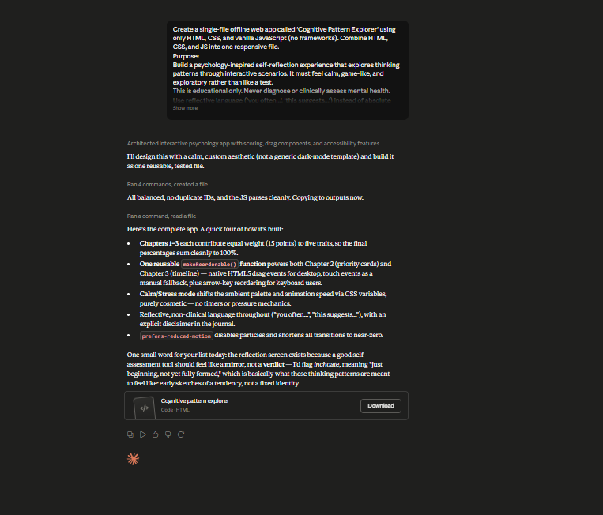

# Day 36: Cognitive Pattern Explorer with Claude

## Objective

Learn how Claude can generate complete educational applications that encourage self-reflection through interactive scenarios, decision-making activities, and personalized insights.

This exercise demonstrates how AI can transform cognitive learning into an engaging browser-based experience where users explore their thinking patterns through guided interactions instead of traditional questionnaires.

---

## Tools Used

- Claude AI
- Cognitive Pattern Explorer Prompt
- HTML
- CSS
- JavaScript
- GitHub
- Markdown

---

## Folder Structure

```text
Day-36/
├── README.md
├── cognitive_pattern_explorer.html
└── screenshots/
    └── cognitive_pattern_explorer.png
```

---

## What I Did

For Day 36, I explored how Claude can generate an interactive educational application focused on understanding different thinking styles.

Using the provided Cognitive Pattern Explorer prompt, Claude generated a complete browser-based application that helps users explore their decision-making tendencies through interactive scenarios, drag-and-drop activities, and guided self-reflection.

The application encourages users to recognize their natural thinking preferences while providing a personalized Reflection Journal based on their interactions.

This exercise demonstrated how AI can rapidly create educational applications that promote self-awareness through engaging and interactive experiences.

---

## Application Features

The generated application includes:

- Calm Mode and Stress Mode
- Interactive decision-making scenarios
- Drag-and-drop thinking activities
- Thinking sequence organization
- Personalized Reflection Journal
- Cognitive pattern comparison
- Multiple learning chapters
- Replay with different modes
- Interactive progress tracking

---

## Cognitive Learning Experience

The simulator allows users to explore different aspects of thinking, including:

- Everyday decision-making scenarios
- Recognizing thinking tendencies
- Organizing thought processes
- Comparing responses across different situations
- Reflecting on personal decision-making habits
- Exploring how context influences thinking
- Building greater self-awareness

Each activity provides an opportunity to better understand personal thinking patterns without making clinical assessments.

---

## Interactive Learning Experience

The simulation guides users through the following activities:

- Choose Calm Mode or Stress Mode
- Complete Chapter 1 scenario-based decisions
- Finish drag-and-drop activities in Chapter 2
- Arrange thinking sequences in Chapter 3
- Review the personalized Reflection Journal
- Compare thinking tendencies across all chapters
- Replay the experience using the opposite mode

These activities encourage users to reflect on how they approach everyday decisions and problem-solving situations.

---

## Screenshot

### Cognitive Pattern Explorer



---

## Key Findings

### Everyone Thinks Differently

- People approach decisions using different reasoning styles.
- Thinking patterns can vary depending on the situation and environment.

### Self-Reflection Improves Awareness

- Interactive activities encourage deeper reflection than static questionnaires.
- Recognizing personal tendencies helps improve decision-making.

### Interactive Learning Enhances Engagement

- Scenario-based learning makes cognitive concepts easier to understand.
- Hands-on activities create a more meaningful learning experience.

### AI Accelerates Educational Application Development

- Claude can generate complete interactive educational applications from natural language prompts.
- AI enables rapid development of engaging learning experiences without extensive manual coding.

---

## Key Learnings

- AI can generate complete educational web applications.
- Interactive scenarios improve self-reflection and engagement.
- Thinking styles may change depending on context and priorities.
- Drag-and-drop activities create more interactive learning experiences.
- Browser-based applications are effective for teaching cognitive concepts.
- AI accelerates both educational content creation and software development.

---

## Outcome

Successfully used Claude AI to generate an interactive **Cognitive Pattern Explorer** application. The project demonstrated how AI can simplify self-reflection through engaging educational experiences, helping users explore different thinking styles while showcasing the power of AI-generated interactive learning applications as part of the **#60DaysOfClaude** challenge.