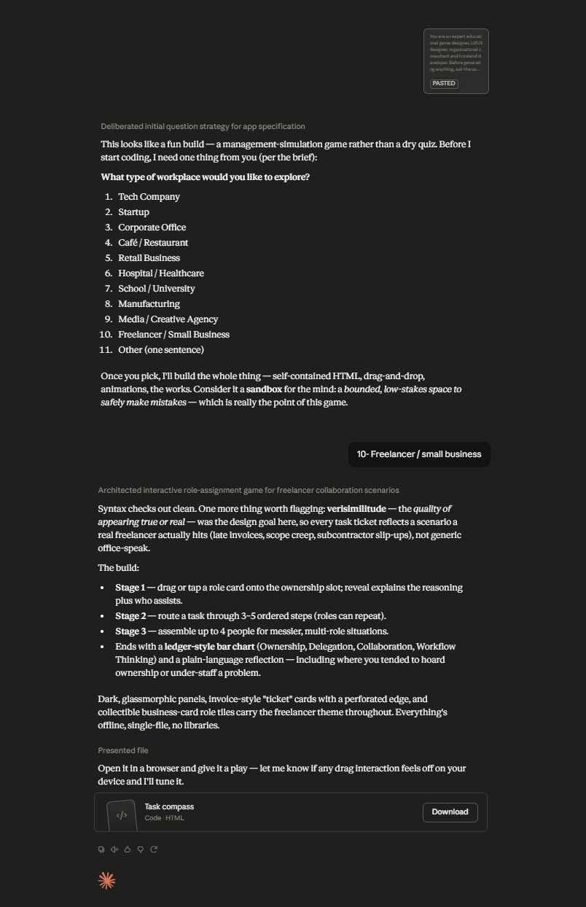

# Day 37: Task Compass with Claude

## Objective

Learn how Claude can generate complete educational applications that teach organizational thinking through interactive management simulations.

This exercise demonstrates how AI can transform workplace management concepts into an engaging browser-based learning experience where users develop ownership, delegation, collaboration, and workflow skills through hands-on activities.

---

## Tools Used

- Claude AI
- Task Compass Prompt
- HTML
- CSS
- JavaScript
- GitHub
- Markdown

---

## Folder Structure

```text
Day-37/
├── README.md
├── task_compass.html
└── screenshots/
    └── task_compass.png
```

---

## What I Did

For Day 37, I explored how Claude can generate an interactive educational application focused on organizational management and workplace collaboration.

Using the provided Task Compass prompt, Claude generated a complete browser-based application that teaches users how organizations operate through interactive workplace scenarios instead of traditional management lessons.

The application guides users through ownership decisions, task routing exercises, and collaboration challenges while providing a personalized Organizational Thinking Dashboard at the end.

This exercise demonstrated how AI can rapidly create educational applications that make workplace management concepts practical, engaging, and easy to understand.

---

## Application Features

The generated application includes:

- Workplace Type Selection
- Ownership Decision Challenges
- Task Routing Activities
- Collaboration Challenges
- Organizational Thinking Dashboard
- Interactive Workflow Simulation
- Multiple Workplace Scenarios
- Replay with Different Organizations
- Progress Tracking

---

## Organizational Thinking Experience

The simulator allows users to explore important workplace concepts, including:

- Identifying task ownership
- Understanding organizational workflows
- Routing tasks to the correct departments
- Solving collaboration challenges
- Coordinating multiple teams
- Improving decision-making
- Understanding workplace responsibilities

Each activity demonstrates how effective communication, delegation, and teamwork contribute to successful organizations.

---

## Interactive Learning Experience

The simulation guides users through the following activities:

- Choose a workplace type
- Complete Stage 1: Who Owns This?
- Complete Stage 2: Task Routing
- Complete Stage 3: Collaboration Challenge
- Review the Organizational Thinking Dashboard
- Replay using another workplace type

These activities provide practical experience in understanding organizational structure, teamwork, and workflow management.

---

## Screenshot

### Task Compass Application



---

## Key Findings

### Clear Ownership Improves Efficiency

- Assigning tasks to the right people reduces confusion.
- Well-defined responsibilities improve productivity.

### Collaboration Solves Complex Problems

- Many workplace challenges require multiple departments.
- Effective teamwork leads to better business outcomes.

### Workflow Matters

- Understanding how work moves across teams improves organizational efficiency.
- Proper task routing reduces delays and communication gaps.

### AI Accelerates Educational Application Development

- Claude can generate complete interactive learning applications from natural language prompts.
- AI enables rapid development of practical educational tools for management and organizational learning.

---

## Key Learnings

- AI can generate complete educational web applications.
- Clear ownership improves workplace efficiency.
- Collaboration is essential for solving complex organizational challenges.
- Understanding workflows leads to better decision-making.
- Interactive learning makes management concepts easier to understand.
- AI accelerates both software development and educational content creation.

---

## Outcome

Successfully used Claude AI to generate an interactive **Task Compass** application. The project demonstrated how AI can simplify organizational thinking through gamified learning, helping users understand ownership, delegation, workflows, and collaboration while showcasing the power of AI-generated educational applications as part of the **#60DaysOfClaude** challenge.