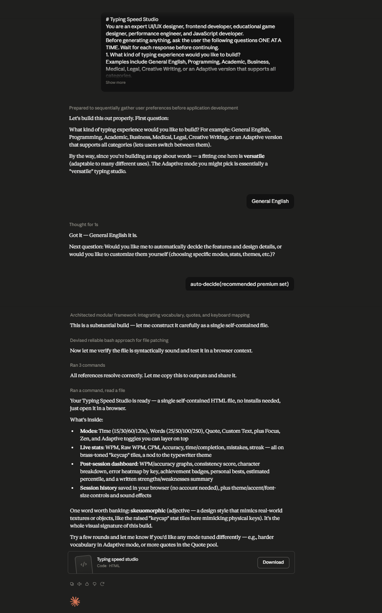

# Day 38: Typing Speed Studio with Claude

## Objective

Learn how Claude can generate complete productivity applications that provide an engaging typing practice experience with adaptive learning, real-time analytics, and premium user interface design.

This exercise demonstrates how AI can transform a simple typing test into a modern browser-based application featuring intelligent practice modes, performance tracking, and interactive dashboards.

---

## Tools Used

- Claude AI
- Typing Speed Studio Prompt
- HTML
- CSS
- JavaScript
- GitHub
- Markdown

---

## Folder Structure

```text
Day-38/
├── README.md
├── typing_speed_studio.html
└── screenshots/
    └── typing_speed_studio.png
```

---

## What I Did

For Day 38, I explored how Claude can generate a professional typing practice application with modern productivity features.

Using the provided Typing Speed Studio prompt, Claude generated a complete browser-based application that helps users improve their typing speed and accuracy through multiple practice modes, adaptive learning, and real-time performance analytics.

The application delivers an engaging user experience with live typing statistics, intelligent feedback, achievement tracking, and a visually polished interface similar to premium productivity software.

This exercise demonstrated how AI can rapidly create commercial-quality web applications from natural language prompts.

---

## Application Features

The generated application includes:

- Multiple typing practice modes
- Real-time typing statistics
- Words Per Minute (WPM) tracking
- Accuracy measurement
- Live progress dashboard
- Adaptive practice system
- Performance analytics
- Achievement and scoring system
- Responsive modern interface
- Interactive typing sessions

---

## Typing Practice Experience

The application allows users to improve their typing skills by exploring features such as:

- Multiple typing difficulty levels
- Speed and accuracy tracking
- Real-time performance feedback
- Adaptive learning based on user performance
- Session history and analytics
- Progress monitoring
- Interactive typing exercises
- Performance improvement recommendations

Each typing session provides immediate feedback, helping users monitor their improvement over time.

---

## Interactive Learning Experience

The application guides users through the following activities:

- Complete the onboarding setup
- Choose a typing practice mode
- Finish multiple typing sessions
- Monitor live typing statistics
- Review performance analytics
- Analyze the typing dashboard
- Track improvements over time
- Continue practicing using adaptive learning

These activities provide an engaging and effective way to improve typing speed and accuracy.

---

## Screenshot

### Typing Speed Studio



---

## Key Findings

### Consistent Practice Improves Performance

- Regular typing practice increases both speed and accuracy.
- Real-time feedback helps users identify areas for improvement.

### Live Analytics Enhance Learning

- Performance dashboards provide valuable insights into typing progress.
- Tracking WPM and accuracy motivates continuous improvement.

### Interactive Applications Increase Engagement

- Gamified practice sessions create a more enjoyable learning experience.
- Adaptive learning keeps users challenged at the appropriate level.

### AI Accelerates Productivity Application Development

- Claude can generate complete productivity applications from natural language prompts.
- AI significantly reduces development time while producing modern, interactive user experiences.

---

## Key Learnings

- AI can generate complete productivity web applications.
- Real-time analytics improve the overall learning experience.
- Adaptive learning creates more personalized practice sessions.
- Interactive dashboards help users track long-term progress.
- Browser-based applications are effective for skill development.
- AI accelerates both software development and educational application creation.

---

## Outcome

Successfully used Claude AI to generate an interactive **Typing Speed Studio** application. The project demonstrated how AI can simplify productivity application development by creating a professional typing practice platform with adaptive learning, real-time analytics, and a modern user experience as part of the **#60DaysOfClaude** challenge.