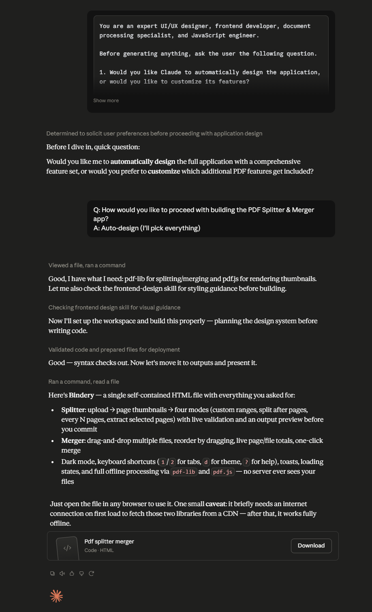

# Day 39: PDF Splitter & Merger with Claude

## Objective

Learn how Claude can generate complete productivity applications by building a browser-based PDF Splitter & Merger with a professional user interface, drag-and-drop functionality, PDF previews, and secure client-side processing.

This exercise demonstrates how AI can transform document management into a modern web application that works entirely within the browser while maintaining user privacy and supporting offline usage.

---

## Tools Used

- Claude AI
- PDF Splitter & Merger Prompt
- HTML
- CSS
- JavaScript
- PDF-Lib
- GitHub
- Markdown

---

## Folder Structure

```text
Day-39/
├── README.md
├── pdf_splitter_merger.html
├── processed-files/
│   ├── split.pdf
│   └── merged.pdf
└── screenshots/
    └── pdf_splitter_merger.png
```

---

## What I Did

For Day 39, I explored how Claude can generate a professional browser-based PDF Splitter & Merger application with modern productivity features.

Using the provided PDF Splitter & Merger prompt, Claude generated a complete HTML application capable of splitting PDF documents into selected pages and merging multiple PDF files into a single document. The application processes files entirely within the browser, ensuring privacy and eliminating the need for server-side uploads.

This exercise demonstrated how AI can rapidly create commercial-quality document management software with an intuitive interface, drag-and-drop functionality, PDF previews, and offline support.

---

## Application Features

The generated application includes:

- Split PDF documents by selected pages or page ranges
- Merge multiple PDF files into a single document
- Drag-and-drop file upload
- Client-side PDF processing
- PDF preview before processing
- Instant download of processed PDFs
- Modern responsive user interface
- Offline functionality
- Secure document processing without server uploads
- Interactive document management workflow

---

## PDF Processing Experience

The application allows users to efficiently manage PDF documents through features such as:

- Uploading PDF files using drag-and-drop
- Selecting pages for splitting
- Combining multiple PDFs into one document
- Previewing uploaded files before processing
- Downloading processed PDFs instantly
- Performing all operations securely within the browser
- Working completely offline without an internet connection

Each workflow is designed to provide a smooth and user-friendly document management experience.

---

## Interactive Learning Experience

The application guides users through the following activities:

- Upload PDF documents
- Choose Split or Merge mode
- Select page ranges for splitting
- Add multiple PDF files for merging
- Preview uploaded documents
- Process PDF files instantly
- Download the generated PDFs
- Manage documents securely using client-side processing

These activities demonstrate how browser-based applications can provide powerful productivity tools without relying on backend services.

---

## Screenshot

### PDF Splitter & Merger



---

## Key Findings

### Client-Side Processing Improves Privacy

- PDF files remain on the user's device throughout processing.
- No documents are uploaded to external servers.

### Modern User Interfaces Improve Productivity

- Drag-and-drop interactions simplify document management.
- Responsive layouts provide a seamless experience across devices.

### Browser Applications Can Replace Desktop Tools

- Modern web technologies enable advanced PDF processing directly in the browser.
- Offline functionality makes the application accessible anywhere.

### AI Accelerates Productivity Application Development

- Claude can generate complete document management applications from natural language prompts.
- AI significantly reduces development time while producing professional-quality software.

---

## Key Learnings

- AI can generate complete browser-based productivity applications.
- Client-side processing enhances both privacy and performance.
- PDF-Lib enables advanced PDF manipulation using JavaScript.
- Interactive user interfaces improve document management workflows.
- Offline web applications provide reliable productivity solutions.
- AI accelerates software development by generating production-ready applications.

---

## Outcome

Successfully used Claude AI to generate an interactive **PDF Splitter & Merger** application. The project demonstrated how AI can simplify productivity software development by creating a professional browser-based solution for splitting and merging PDF documents with secure client-side processing, modern user interface design, and offline functionality as part of the **#60DaysOfClaude** challenge.