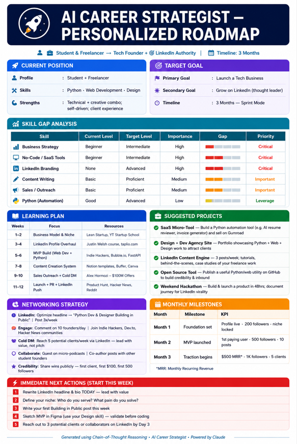
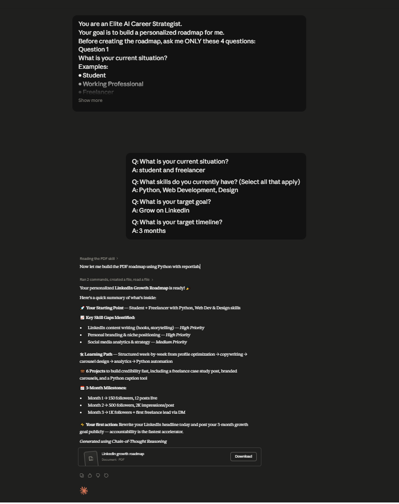

# Day 4 - Chain-of-Thought Prompting

## Objective

The objective of this exercise was to learn how Chain-of-Thought (CoT) Prompting improves AI reasoning by encouraging the model to think through a problem step-by-step before generating a final answer.

---

## What is Chain-of-Thought Prompting?

Chain-of-Thought Prompting is a technique that guides AI to break down complex problems into smaller reasoning steps before reaching a conclusion.

Instead of generating an immediate answer, the AI evaluates the situation, analyzes options, identifies assumptions, and then produces a more thoughtful and reliable response.

This approach is especially useful for:

* Career planning
* Business strategy
* Decision-making
* Learning roadmaps
* Project planning

---

## Exercise Completed

I used the provided AI Career Strategist prompt and answered the following questions:

1. Current Situation
2. Current Skills
3. Target Goal
4. Target Timeline

Based on my answers, Claude generated a personalized career roadmap with actionable recommendations.

---

## Personalized Roadmap Summary

### Current Position

* Final-Year Computer Science Student
* MERN Stack Developer
* Freelancer

### Target Goal

* Grow personal brand on LinkedIn
* Attract freelance opportunities
* Build authority in Web Development and Design

### Timeline

* 3 Months

---

## Key Recommendations

### Learning Priorities

* LinkedIn Content Strategy
* Personal Branding
* Content Writing
* Hook Writing
* Audience Building

### Suggested Projects

* LinkedIn Case Studies
* UI/UX Challenge Series
* Design Tip Carousels
* Client Website Redesign Posts
* Free Resource Creation

### Networking Strategy

* Connect with professionals daily
* Engage through meaningful comments
* Join LinkedIn creator communities
* Build relationships through collaboration

---

## Screenshots

### Career Roadmap



### Claude Conversation



---

## Biggest Insight

The biggest insight from this exercise was that AI becomes significantly more useful when it is encouraged to reason step-by-step. Instead of providing generic advice, Chain-of-Thought Prompting produced a personalized roadmap with clear milestones, priorities, and actionable next steps.

---

## Key Learnings

* Breaking problems into smaller steps improves AI output quality.
* Structured reasoning produces more reliable recommendations.
* Personalized roadmaps are more actionable than generic advice.
* AI can be used as a strategic thinking partner.
* Chain-of-Thought Prompting is valuable for career planning and decision-making.

---

## Capsule Hub Extension

### Purpose

Capsule Hub helps organize prompts, reusable workflows, instructions, and AI context in one place.

### Activities Completed

* Installed Capsule Hub
* Connected it with Claude workflow
* Explored prompt organization features
* Created my first reusable prompt capsule

---

## Conclusion

Day 4 demonstrated how Chain-of-Thought Prompting can transform AI from a simple answering tool into a strategic planning assistant. By guiding AI through structured reasoning, the outputs become more accurate, personalized, and actionable.

This technique will be valuable for future career planning, project management, freelancing, and business decisions.

---

## Folder Structure

```

Day-4/
├── Readme.md
└── screenshots/
├── career-roadmap.png
└── claude-roadmap-chat.png

```