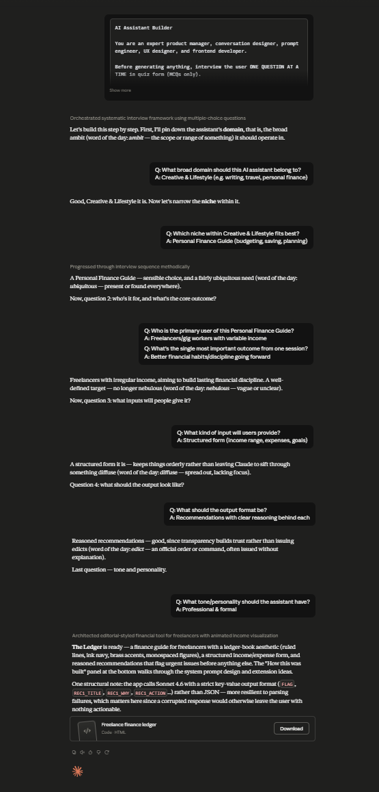

# Day 40: AI Assistant Builder with Claude

## Objective

Learn how Claude can generate complete AI assistant applications by designing assistants from scratch through user interviews, system prompt engineering, interface design, and interactive documentation.

This exercise demonstrates how AI can transform the process of building intelligent assistants into a complete browser-based application with production-quality user experience and prompt engineering.

---

## Tools Used

- Claude AI
- AI Assistant Builder Prompt
- HTML
- CSS
- JavaScript
- GitHub
- Markdown

---

## Folder Structure

```text
Day-40/
├── README.md
├── ai_assistant_builder.html
├── system_prompt.txt
└── screenshots/
    └── ai_assistant_builder.png
```

---

## What I Did

For Day 40, I explored how Claude can generate a complete AI Assistant Builder that helps users design professional AI assistants from the ground up.

Using the provided AI Assistant Builder prompt, Claude generated a browser-based application that walks users through an interview process to understand the assistant's purpose, target audience, capabilities, and behavior.

Based on the collected information, the application automatically generates a production-quality system prompt, creates a customized interface, and provides documentation for the assistant.

This exercise demonstrated how AI can rapidly build complete AI products by combining prompt engineering, user experience design, and documentation into a single workflow.

---

## Application Features

The generated application includes:

- Interactive assistant interview
- User requirement collection
- AI assistant customization
- Production-quality system prompt generation
- Live assistant preview
- Documentation panel
- Professional interface design
- Responsive user experience
- Modern dashboard layout
- Browser-based application

---

## AI Assistant Building Experience

The application allows users to design an AI assistant by exploring concepts such as:

- Defining assistant goals
- Identifying target users
- Selecting assistant personality
- Designing conversation behavior
- Creating production-ready system prompts
- Reviewing generated documentation
- Testing assistant responses
- Refining assistant capabilities

Each step demonstrates how thoughtful prompt engineering and interface design contribute to building effective AI assistants.

---

## Interactive Learning Experience

The application guides users through the following activities:

- Answer assistant design interview questions
- Configure assistant behavior
- Generate a professional system prompt
- Test the AI assistant
- Review generated documentation
- Explore the assistant interface
- Refine assistant settings
- Analyze the final assistant design

These activities provide practical experience in designing AI-powered products using prompt engineering and user-centered design principles.

---

## Screenshot

### AI Assistant Builder



---

## Key Findings

### AI Products Begin with User Needs

- Successful AI assistants are designed around solving specific user problems.
- Understanding user requirements leads to more useful and effective assistants.

### Prompt Engineering Shapes Assistant Behavior

- Well-structured system prompts define the assistant's personality, knowledge, and response style.
- Small improvements in prompt design significantly enhance AI performance.

### Great UX Improves AI Products

- Professional interfaces make AI assistants easier and more enjoyable to use.
- Clear workflows and documentation improve the overall user experience.

### AI Accelerates Product Development

- Claude can generate complete AI applications from natural language prompts.
- AI dramatically reduces the time required to prototype production-quality software.

---

## Key Learnings

- AI can generate complete AI assistant applications.
- System prompts are the foundation of assistant behavior.
- User interviews help create more effective AI solutions.
- Combining UX design with prompt engineering improves AI products.
- Browser-based applications can deliver professional AI experiences.
- AI accelerates software development, product design, and documentation.

---

## Outcome

Successfully used Claude AI to generate an interactive **AI Assistant Builder** application. The project demonstrated how AI can simplify the design and development of production-ready AI assistants by combining user interviews, prompt engineering, interface design, and documentation into a complete browser-based experience as part of the **#60DaysOfClaude** challenge.