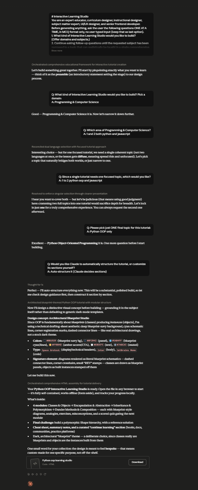

# Day 41: Interactive Learning Studio with Claude

## Objective

Learn how Claude can generate complete interactive educational platforms by combining instructional design, quizzes, practical exercises, diagrams, and projects into a single browser-based learning experience.

This exercise demonstrates how AI can transform traditional tutorials into engaging learning applications that help users build knowledge through interactive modules, assessments, and hands-on activities.

---

## Tools Used

- Claude AI
- Interactive Learning Studio Prompt
- HTML
- CSS
- JavaScript
- GitHub
- Markdown

---

## Folder Structure

```text
Day-41/
├── README.md
├── interactive_learning_studio.html
└── screenshots/
    └── interactive_learning_studio.png
```

---

## What I Did

For Day 41, I explored how Claude can generate a complete Interactive Learning Studio that delivers an engaging educational experience through structured lessons and interactive activities.

Using the provided Interactive Learning Studio prompt, Claude generated a browser-based learning platform featuring progressive learning modules, quizzes, practical exercises, progress tracking, and a final project challenge.

The application guides learners through each topic step-by-step while providing instant feedback and monitoring learning progress.

This exercise demonstrated how AI can rapidly build production-quality educational platforms that make learning more interactive, engaging, and effective.

---

## Application Features

The generated application includes:

- Interactive learning modules
- Step-by-step instructional content
- Progress tracking dashboard
- Interactive quizzes
- Knowledge checks
- Practical exercises
- Final project challenge
- Responsive learning interface
- Modern educational UI
- Browser-based application

---

## Interactive Learning Experience

The application allows users to explore educational content through:

- Structured learning modules
- Interactive explanations
- Knowledge assessment quizzes
- Practical coding exercises
- Progress monitoring
- Hands-on learning activities
- Final practical challenge
- Performance feedback

Each learning module builds upon the previous one, creating a complete and engaging educational experience.

---

## Learning Activities

The platform guides users through the following activities:

- Complete all four learning modules
- Read interactive lessons
- Attempt every quiz
- Finish practical exercises
- Track learning progress
- Complete the final project challenge
- Review overall performance
- Continue learning through interactive practice

These activities provide an effective way to understand new concepts through active participation rather than passive reading.

---

## Screenshot

### Interactive Learning Studio



---

## Key Findings

### Interactive Learning Improves Understanding

- Breaking lessons into smaller modules makes complex topics easier to understand.
- Combining explanations with hands-on activities improves knowledge retention.

### Practice Reinforces Learning

- Quizzes and exercises help learners immediately apply new concepts.
- Practical challenges build confidence through real-world problem solving.

### Educational Design Matters

- Progress tracking motivates learners to complete learning paths.
- Well-designed interfaces create a more enjoyable learning experience.

### AI Accelerates Educational Platform Development

- Claude can generate complete educational applications from natural language prompts.
- AI significantly reduces the time required to build professional learning platforms.

---

## Key Learnings

- AI can generate complete educational web applications.
- Interactive lessons improve learner engagement.
- Quizzes and practical exercises reinforce understanding.
- Progress tracking encourages continuous learning.
- Browser-based applications provide accessible educational experiences.
- AI accelerates both software development and educational content creation.

---

## Outcome

Successfully used Claude AI to generate an interactive **Interactive Learning Studio** application. The project demonstrated how AI can simplify educational platform development by combining instructional design, quizzes, practical exercises, and progress tracking into a complete browser-based learning experience as part of the **#60DaysOfClaude** challenge.