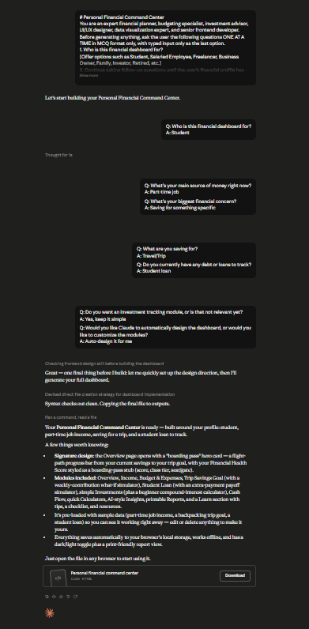

# Day 42: Personal Financial Command Center with Claude

## Objective

Learn how Claude can generate complete financial management applications by combining budgeting, financial planning, analytics, simulations, and AI-powered recommendations into a single interactive dashboard.

This exercise demonstrates how AI can transform personal finance management into a modern browser-based application that helps users monitor financial health, analyze spending habits, and make informed financial decisions.

---

## Tools Used

- Claude AI
- Personal Financial Command Center Prompt
- HTML
- CSS
- JavaScript
- GitHub
- Markdown

---

## Folder Structure

```text
Day-42/
├── README.md
├── personal_financial_command_center.html
└── screenshots/
    └── personal_financial_command_center.png
```

---

## What I Did

For Day 42, I explored how Claude can generate a complete Personal Financial Command Center that brings budgeting, financial planning, analytics, and personalized recommendations into one interactive application.

Using the provided Personal Financial Command Center prompt, Claude generated a browser-based financial dashboard featuring budgeting tools, expense tracking, financial health analysis, AI-powered recommendations, interactive simulations, and visual reports.

The application provides users with valuable insights into their financial status while helping them explore different financial scenarios through interactive dashboards and simulations.

This exercise demonstrated how AI can rapidly build professional financial applications that simplify personal finance management and decision-making.

---

## Application Features

The generated application includes:

- Personal financial dashboard
- Budget planning and tracking
- Income and expense management
- Financial health score
- AI-powered financial recommendations
- Interactive charts and visualizations
- What-if financial simulations
- Personalized financial reports
- Responsive modern interface
- Browser-based application

---

## Financial Management Experience

The application allows users to explore important financial planning concepts, including:

- Monitoring income and expenses
- Creating and managing budgets
- Tracking financial health
- Reviewing spending patterns
- Exploring future financial scenarios
- Understanding savings opportunities
- Receiving AI-generated financial recommendations
- Improving overall financial planning

Each module provides meaningful insights that help users make better financial decisions through interactive analysis and visual reporting.

---

## Interactive Learning Experience

The application guides users through the following activities:

- Complete the onboarding interview
- Explore every financial dashboard module
- Review income and expense analysis
- Check the Financial Health Score
- Analyze AI-generated recommendations
- Run what-if financial simulations
- Review personalized financial reports
- Explore interactive charts and analytics

These activities provide practical experience in understanding personal finance through an engaging and interactive interface.

---

## Screenshot

### Personal Financial Command Center



---

## Key Findings

### Financial Dashboards Improve Decision-Making

- Centralized financial information makes budgeting easier.
- Visual dashboards help users quickly understand their financial situation.

### Interactive Analytics Increase Financial Awareness

- Charts and reports reveal spending patterns and savings opportunities.
- Simulations help users evaluate future financial decisions before making them.

### Personalization Creates Better User Experiences

- AI-generated recommendations provide guidance based on individual financial profiles.
- Personalized insights make financial planning more practical and actionable.

### AI Accelerates Financial Application Development

- Claude can generate complete financial management applications from natural language prompts.
- AI significantly reduces development time while producing modern, interactive financial tools.

---

## Key Learnings

- AI can generate complete financial web applications.
- Interactive dashboards improve financial planning and analysis.
- Personalized recommendations help users make informed financial decisions.
- Simulations provide valuable insights into future financial outcomes.
- Browser-based applications offer accessible and engaging financial management experiences.
- AI accelerates both software development and financial application design.

---

## Outcome

Successfully used Claude AI to generate an interactive **Personal Financial Command Center** application. The project demonstrated how AI can simplify personal finance management by combining budgeting, analytics, simulations, and personalized recommendations into a professional browser-based dashboard as part of the **#60DaysOfClaude** challenge.