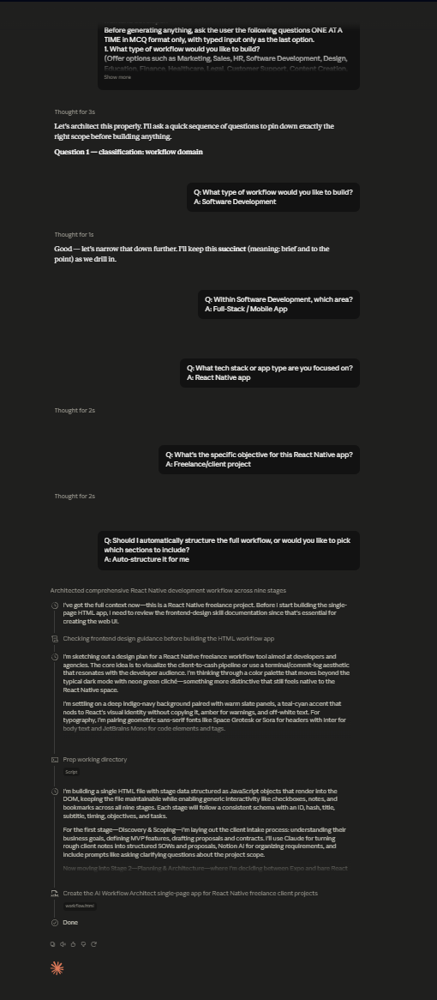

# Day 43: AI Workflow Architect with Claude

## Objective

Learn how Claude can generate complete workflow management applications that help users design, analyze, and optimize end-to-end business processes using AI-powered recommendations and interactive visualizations.

This exercise demonstrates how AI can transform workflow planning into an engaging browser-based experience where users identify automation opportunities, select the right AI tools, and improve productivity through structured workflow design.

---

## Tools Used

- Claude AI
- AI Workflow Architect Prompt
- HTML
- CSS
- JavaScript
- GitHub
- Markdown

---

## Folder Structure

```text
Day-43/
├── README.md
├── ai_workflow_architect.html
└── screenshots/
    └── workflow_dashboard.png
```

---

## What I Did

For Day 43, I explored how Claude can generate a complete AI-powered workflow management application.

Using the provided AI Workflow Architect prompt, Claude generated a browser-based application that allows users to design workflows, discover automation opportunities, select appropriate AI tools, and visualize productivity improvements.

The application guides users through every stage of workflow planning while providing AI recommendations, prompt suggestions, automation insights, and an interactive workflow dashboard.

This exercise demonstrated how AI can rapidly generate productivity applications that simplify workflow optimization and encourage better organizational thinking.

---

## Application Features

The generated application includes:

- Interactive workflow designer
- AI workflow mapping
- Workflow stage visualization
- AI tool recommendations
- Prompt suggestions for each workflow stage
- Automation opportunity analysis
- Productivity dashboard
- Workflow performance insights
- Future automation recommendations

---

## AI Workflow Experience

The application allows users to explore important workflow management concepts, including:

- Mapping end-to-end workflows
- Identifying repetitive tasks
- Selecting AI tools for each workflow stage
- Creating effective AI prompts
- Discovering automation opportunities
- Improving team productivity
- Optimizing business processes

Each workflow stage demonstrates how AI can streamline operations and reduce manual effort through intelligent automation.

---

## Interactive Learning Experience

The application guides users through the following activities:

- Complete the workflow interview
- Explore every workflow stage
- Review AI tool recommendations
- Analyze automation opportunities
- Study workflow visualizations
- Review productivity insights
- Explore future workflow improvements

These activities provide practical experience in workflow design, AI integration, and business process optimization.

---

## Screenshot

### AI Workflow Architect Dashboard



---

## Key Findings

### Workflow Design Improves Productivity

- Breaking work into structured stages makes complex processes easier to manage.
- Well-designed workflows improve efficiency and reduce unnecessary tasks.

### AI Enhances Workflow Automation

- AI tools can automate repetitive activities and support decision-making.
- Matching the right AI tool to each workflow stage improves overall performance.

### Interactive Learning Simplifies Workflow Thinking

- Visual workflow mapping makes process optimization easier to understand.
- Hands-on interaction helps users recognize automation opportunities.

### AI Accelerates Productivity Application Development

- Claude can generate complete workflow management applications from natural language prompts.
- AI enables rapid development of professional productivity tools without extensive manual coding.

---

## Key Learnings

- AI can generate complete workflow management applications.
- Workflow design helps organize complex business processes.
- AI tool selection improves efficiency across different workflow stages.
- Automation opportunities reduce repetitive work and increase productivity.
- Interactive dashboards make workflow analysis more effective.
- AI accelerates software development and productivity application creation.

---

## Outcome

Successfully used Claude AI to generate an interactive **AI Workflow Architect** application. The project demonstrated how AI can simplify workflow planning, identify automation opportunities, recommend AI tools, and visualize business processes through an engaging browser-based experience as part of the **#60DaysOfClaude** challenge.