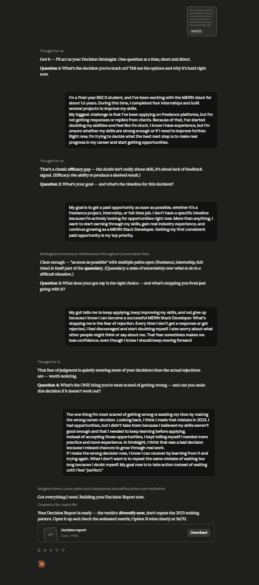

# Day 45: AI Decision Support System with Claude

## Objective

Learn how Claude can generate AI-powered decision support applications that help users make better decisions through structured thinking, option comparison, bias detection, and interactive decision reports.

This exercise demonstrates how AI can transform complex decision-making into an interactive browser-based experience that guides users through every step of the decision process.

---

## Tools Used

- Claude AI
- AI Decision Support System Prompt
- HTML
- CSS
- JavaScript
- GitHub
- Markdown

---

## Folder Structure

```text
Day-45/
├── README.md
├── decision-report.html
└── screenshots/
    └── decision_support_system.png
```

---

## What I Did

For Day 45, I explored how Claude can generate a complete AI-powered Decision Support System.

Using the provided prompt, Claude created a browser-based application that helps users evaluate important decisions through structured workflows, decision matrices, bias analysis, and AI-generated recommendations.

The application walks users through defining a decision, comparing multiple options, identifying possible cognitive biases, and generating a professional decision report.

This exercise demonstrated how AI can rapidly build practical productivity applications that simplify complex decision-making.

---

## Application Features

The generated application includes:

- Interactive decision workflow
- Decision matrix and option comparison
- Bias and assumption detection
- Pros and cons evaluation
- AI-powered recommendations
- Decision scoring system
- Professional decision report
- Responsive modern interface
- Browser-based application

---

## Decision-Making Experience

The application allows users to:

- Define a decision problem
- Compare multiple options
- Evaluate advantages and disadvantages
- Detect assumptions and cognitive biases
- Score available choices
- Generate AI-powered recommendations
- Review a professional decision report
- Improve confidence in decision-making

Each step encourages structured thinking instead of relying on intuition alone.

---

## Interactive Learning Experience

The application guides users through the following activities:

- Complete the onboarding interview
- Define the decision scenario
- Compare different options
- Analyze assumptions and biases
- Review AI-generated insights
- Generate the final decision report
- Explore alternative outcomes

These activities provide practical experience in making thoughtful and well-structured decisions.

---

## Screenshot

### AI Decision Support System



---

## Key Findings

### Structured Thinking Improves Decisions

- Breaking decisions into smaller steps makes complex choices easier to evaluate.
- Comparing options objectively leads to better outcomes.

### Recognizing Bias Leads to Better Judgment

- Identifying assumptions helps reduce common decision-making mistakes.
- Structured evaluation improves confidence in final decisions.

### Interactive Applications Enhance Learning

- Hands-on activities make decision frameworks easier to understand.
- Visual reports simplify complex comparisons.

### AI Accelerates Productivity Application Development

- Claude can generate complete decision support applications from natural language prompts.
- AI significantly reduces development time while creating polished browser-based tools.

---

## Key Learnings

- AI can generate complete decision support applications.
- Structured decision frameworks improve critical thinking.
- Bias detection helps users make more informed choices.
- Interactive dashboards simplify option comparison.
- Browser-based applications provide an engaging user experience.
- AI accelerates both software development and productivity tool creation.

---

## Outcome

Successfully used Claude AI to generate an interactive **AI Decision Support System**. This project demonstrated how AI can simplify decision-making through structured workflows, option comparison, bias detection, and AI-powered recommendations, showcasing the potential of browser-based productivity applications as part of the **#60DaysOfClaude** challenge.