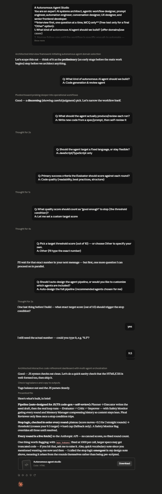

# Day 46: Autonomous Agent Studio with Claude

## Objective

Learn how Claude can generate AI-powered multi-agent systems that coordinate planning, execution, evaluation, memory, and safety through an interactive browser-based application.

This exercise demonstrates how AI can simulate modern autonomous agent architectures where specialized agents collaborate, critique, refine, and iterate until predefined goals are successfully achieved.

---

## Tools Used

- Claude AI
- Autonomous Agent Studio Prompt
- HTML
- CSS
- JavaScript
- GitHub
- Markdown

---

## Folder Structure

```text
Day-46/
├── README.md
├── autonomous_agent_studio.html
└── screenshots/
    └── autonomous_agent_studio.png
```

---

## What I Did

For Day 46, I explored how Claude can generate a complete Autonomous Agent Studio that demonstrates how multiple AI agents collaborate to solve complex workflows.

Using the provided Autonomous Agent Studio prompt, Claude generated a browser-based application where specialized AI agents work together through planning, execution, evaluation, memory management, and safety checks.

The application visualizes the orchestration process, allowing users to observe autonomous workflows, monitor execution history, review stopping conditions, and understand how iterative improvements are made before reaching the final result.

This exercise demonstrated how AI can rapidly build interactive simulations of modern multi-agent systems used in production AI applications.

---

## Application Features

The generated application includes:

- Multi-agent orchestration workflow
- Autonomous planning agent
- Task execution agent
- Evaluation and critique agent
- Memory management system
- Safety validation checks
- Iterative improvement loop
- Execution history dashboard
- Workflow stopping conditions
- Modern responsive interface

---

## Autonomous Agent Experience

The application allows users to explore important concepts including:

- Multi-agent collaboration
- Autonomous task planning
- Workflow orchestration
- Continuous output evaluation
- Memory and context management
- Safety verification
- Iterative refinement
- Goal completion monitoring

Each workflow demonstrates how specialized AI agents coordinate with one another to produce better results through continuous improvement.

---

## Interactive Learning Experience

The application guides users through the following activities:

- Complete the onboarding interview
- Generate an autonomous workflow
- Observe the agent orchestration loop
- Monitor planning and execution stages
- Review evaluation and critique cycles
- Analyze execution history
- Explore stopping conditions
- Review final workflow results

These activities provide practical insight into how modern autonomous AI systems coordinate multiple specialized agents.

---

## Screenshot

### Autonomous Agent Studio



---

## Key Findings

### Multi-Agent Collaboration Improves Results

- Specialized AI agents perform better when assigned focused responsibilities.
- Collaboration enables more reliable and higher-quality outcomes.

### Iterative Improvement Produces Better Outputs

- Continuous evaluation and refinement improve overall performance.
- Feedback loops help agents correct mistakes before completing tasks.

### Workflow Orchestration Simplifies Complex Processes

- Coordinating planning, execution, memory, and evaluation creates efficient AI systems.
- Structured workflows improve transparency and reliability.

### AI Accelerates Application Development

- Claude can generate complete multi-agent simulations from natural language prompts.
- AI significantly reduces development time while producing interactive educational applications.

---

## Key Learnings

- AI can generate complete multi-agent web applications.
- Autonomous agents collaborate through structured workflows.
- Iterative evaluation improves output quality.
- Memory and safety are essential components of agentic AI systems.
- Browser-based simulations make complex AI concepts easier to understand.
- AI accelerates both software development and educational application design.

---

## Outcome

Successfully used Claude AI to generate an interactive **Autonomous Agent Studio** application. This project demonstrated how modern multi-agent AI systems coordinate planning, execution, evaluation, memory, and safety through iterative workflows, showcasing the power of browser-based simulations for understanding autonomous AI architectures as part of the **#60DaysOfClaude** challenge.