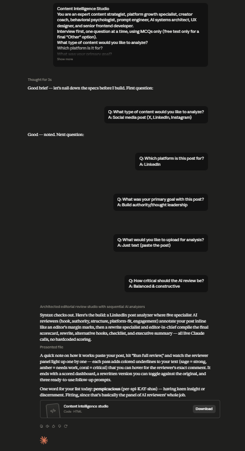

# Day 47: Content Intelligence Studio with Claude

## Objective

Learn how Claude can generate an AI-powered Content Intelligence Studio that analyzes both text and images using multiple specialized AI reviewers. The application provides content scoring, detailed insights, actionable recommendations, and AI-generated summaries through a modern SaaS dashboard.

This exercise demonstrates how AI can perform intelligent content reviews by combining multimodal analysis, live reasoning, and specialized evaluation agents into a single interactive web application.

---

## Tools Used

- Claude AI
- Content Intelligence Studio Prompt
- HTML
- CSS
- JavaScript
- GitHub
- Markdown

---

## Folder Structure

```text
Day-47/
├── README.md
├── content_intelligence_studio.html
└── screenshots/
    └── content_intelligence_studio.png
```

---

## What I Did

For Day 47, I explored how Claude can generate a complete Content Intelligence Studio capable of analyzing both text and images using multiple specialized AI reviewers.

Using the provided Content Intelligence Studio prompt, Claude generated a browser-based application where different AI reviewers evaluate content quality, readability, SEO, grammar, audience engagement, and overall effectiveness.

The application presents the analysis through an interactive SaaS dashboard with quality scores, executive summaries, AI-powered rewrite suggestions, and practical recommendations to improve content performance.

This exercise demonstrated how AI can rapidly build intelligent content review systems that provide detailed, actionable feedback instead of generic responses.

---

## Application Features

The generated application includes:

- Multi-agent AI content review
- Text content analysis
- Image content analysis
- Overall content quality scoring
- SEO analysis and recommendations
- Grammar and readability evaluation
- Audience engagement insights
- AI-generated rewrite suggestions
- Executive summary generation
- Modern responsive SaaS dashboard
- Light and Dark mode support

---

## Content Intelligence Experience

The application allows users to explore important concepts including:

- AI-powered content evaluation
- Multimodal text and image analysis
- Specialized AI reviewers
- Live content scoring
- SEO optimization
- Readability improvement
- AI-generated recommendations
- Executive summaries

Each analysis demonstrates how multiple AI reviewers collaborate to produce comprehensive content insights and actionable recommendations.

---

## Interactive Learning Experience

The application guides users through the following activities:

- Upload or paste content
- Submit text or images for analysis
- Review AI-generated quality scores
- Explore SEO and readability reports
- Analyze audience engagement feedback
- Review executive summaries
- Apply AI rewrite suggestions
- Improve content based on recommendations

These activities provide practical insight into how AI-powered content intelligence platforms can assist creators, marketers, and businesses.

---

## Screenshot

### Content Intelligence Studio



---

## Key Findings

### Multi-Agent AI Produces Better Content Reviews

- Specialized AI reviewers provide more detailed and accurate feedback.
- Combining multiple evaluations results in higher-quality recommendations.

### Multimodal AI Expands Content Analysis

- AI can effectively analyze both written content and visual media.
- Combining text and image analysis provides a more complete content review.

### AI Improves Content Optimization

- Automated recommendations help improve readability, SEO, and engagement.
- Executive summaries make complex analyses easy to understand.

### AI Accelerates Content Review Workflows

- Claude can generate complete content intelligence applications from natural language prompts.
- AI significantly reduces the time required for professional content evaluation.

---

## Key Learnings

- AI can generate complete content intelligence applications.
- Multiple specialized AI reviewers improve analysis quality.
- Multimodal AI enables both text and image evaluation.
- AI-generated recommendations enhance content performance.
- SaaS dashboards make AI insights easy to understand.
- AI accelerates modern content review and optimization workflows.

---

## Outcome

Successfully used Claude AI to generate an interactive **Content Intelligence Studio** application. This project demonstrated how modern AI systems analyze text and images, provide intelligent content scoring, generate actionable recommendations, and deliver executive summaries through a professional SaaS dashboard as part of the **#60DaysOfClaude** challenge.
```