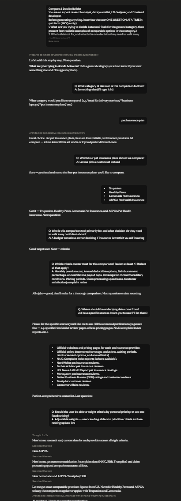

# Day 48: The Verdict Engine with Claude

## Objective

Learn how Claude can generate AI-powered decision support applications that use real, citable information to compare options, rank results, and provide transparent recommendations based on user-defined priorities.

This exercise demonstrates how AI can transform traditional decision-making into an interactive browser-based experience where every recommendation is supported by sources, weighted scoring, and explainable research.

---

## Tools Used

- Claude AI
- The Verdict Engine Prompt
- HTML
- CSS
- JavaScript
- GitHub
- Markdown

---

## Folder Structure

```text
Day-48/
├── README.md
├── verdict_engine.html
└── screenshots/
    └── verdict_engine_dashboard.png
```

---

## What I Did

For Day 48, I explored how Claude can generate a complete AI-powered decision support application focused on transparency and evidence-based recommendations.

Using the provided **The Verdict Engine** prompt, Claude generated a browser-based application that compares multiple options using real-world data, adjustable scoring criteria, source validation, and explainable research.

The application allows users to customize the importance of different decision factors, instantly updating rankings while displaying supporting sources and explaining how each recommendation was produced.

This exercise demonstrated how AI can rapidly build trustworthy decision-support applications that prioritize transparency instead of black-box recommendations.

---

## Application Features

The generated application includes:

- Interactive decision comparison dashboard
- Weighted decision scoring
- Live ranking updates
- Adjustable criteria weights
- Source-backed data references
- Research transparency panel
- Conflict resolution summary
- Evidence-based recommendations
- Responsive modern interface
- Browser-based application

---

## Decision Support Experience

The application allows users to explore important decision-making concepts, including:

- Comparing multiple real-world options
- Assigning custom priority weights
- Viewing live score updates
- Reviewing supporting evidence
- Understanding research methodology
- Resolving conflicting information
- Generating transparent recommendations
- Making informed decisions with confidence

Each interaction demonstrates how structured evaluation and reliable information improve decision quality.

---

## Interactive Learning Experience

The application guides users through the following activities:

- Complete the onboarding interview
- Generate the comparison dashboard
- Adjust criteria weights
- Observe live ranking updates
- Review source references
- Explore the research methodology panel
- Analyze resolved conflicts
- Review the final decision recommendation

These activities provide practical experience in evaluating choices using transparent, evidence-based AI workflows.

---

## Screenshot

### Verdict Engine Dashboard



---

## Key Findings

### Evidence Builds Trust

- Recommendations become more reliable when supported by real, citable sources.
- Transparent research helps users understand how conclusions are reached.

### Personalized Priorities Improve Decisions

- Different users value different criteria.
- Adjustable weighting creates recommendations tailored to individual preferences.

### Explainable AI Increases Confidence

- Showing sources, scoring, and research methods makes AI recommendations easier to trust.
- Openly resolving conflicting information improves transparency.

### AI Accelerates Decision Support Development

- Claude can generate complete decision-support applications from natural language prompts.
- AI significantly reduces development time while creating professional, interactive tools.

---

## Key Learnings

- AI can generate complete evidence-based decision support applications.
- Weighted scoring enables personalized recommendations.
- Transparent research improves trust in AI-generated insights.
- Explainable interfaces help users understand complex decisions.
- Browser-based applications provide engaging and accessible decision-making experiences.
- AI accelerates both software development and intelligent decision-support system design.

---

## Outcome

Successfully used Claude AI to generate an interactive **The Verdict Engine** application. This project demonstrated how AI can combine grounded research, weighted decision scoring, transparent source attribution, and explainable recommendations into a professional browser-based decision support system as part of the **#60DaysOfClaude** challenge.