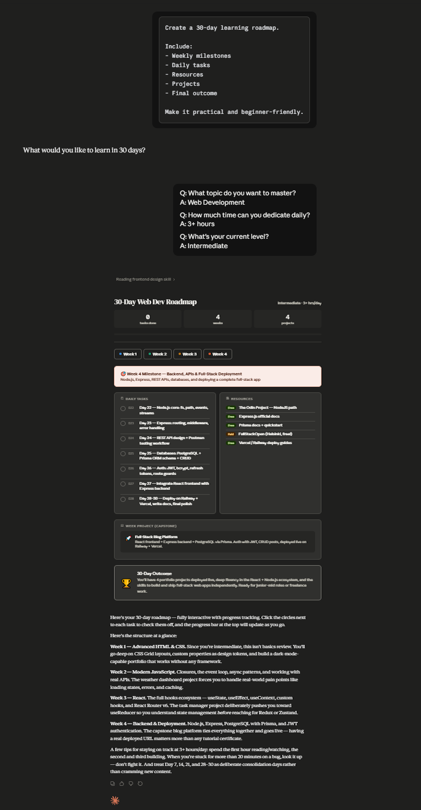
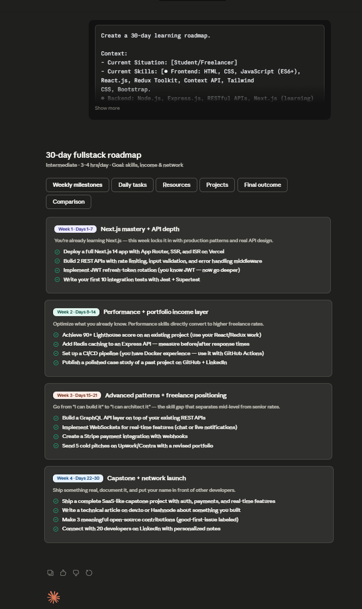

Day 5 – Context Engineering with Claude

## Objective

Today I learned about **Context Engineering**, one of the most important concepts in modern AI systems.

Context Engineering is the practice of providing relevant information, goals, constraints, background, and user-specific details to an AI model before asking it to perform a task.

The quality of context often has a greater impact on the output than the prompt itself.

---

## Tool Used

### Sider AI

Sider AI is a browser-based AI assistant that provides access to multiple AI models and productivity tools directly inside the browser.

### Setup Process

1. Installed the Sider AI browser extension.
2. Pinned the extension to the browser toolbar.
3. Opened webpages and tested AI features.
4. Explored summarization and productivity capabilities.

---

## Task Performed

### Prompt A (Without Personal Context)

Generated output using the provided Prompt A exactly as given.

### Result

The response was generic and designed for a broad audience. It contained useful information but lacked personalization and specific recommendations.

---

### Prompt B (With Personal Context)

Generated output using Prompt B after replacing placeholders with my own information.

### My Context

* Final-year BS Computer Science student
* MERN Stack Developer
* Freelancer on Upwork
* Experience with MongoDB, Express.js, React.js, Node.js
* Building admin dashboards and business management systems
* Interested in AI-assisted development and freelancing growth

### Result

The response was significantly more personalized.

Claude generated:

* Tailored learning recommendations
* Relevant career guidance
* Practical roadmap aligned with my goals
* Actionable suggestions for freelancing and development

---

## Comparison: Prompt A vs Prompt B

| Feature          | Prompt A | Prompt B     |
| ---------------- | -------- | ------------ |
| Personalization  | Low      | High         |
| Relevance        | Generic  | Specific     |
| Career Guidance  | Broad    | Customized   |
| Actionability    | Moderate | High         |
| Learning Roadmap | General  | Personalized |
| Usefulness       | Good     | Excellent    |

---

## Key Learnings

### 1. Context Improves Output Quality

The more information provided to the AI, the better the response becomes.

### 2. AI Makes Fewer Assumptions

Providing background information reduces incorrect assumptions.

### 3. Personalized Recommendations Are More Useful

AI can create recommendations specifically aligned with goals, experience, and interests.

### 4. Context Engineering Powers Modern AI Systems

Most advanced AI assistants and agents rely heavily on context, memory, and retrieval systems.

### 5. Better Inputs Produce Better Results

A well-structured context often matters more than writing a complex prompt.

---

## Screenshots

### Prompt A Output



### Prompt B Output




---

## Real-World Applications

* AI Career Planning
* Personalized Learning Systems
* AI Agents
* Customer Support Automation
* AI Coding Assistants
* Recommendation Systems

---

## Conclusion

Day 5 demonstrated how powerful Context Engineering can be. By providing meaningful background information, goals, and constraints, AI systems can generate more accurate, relevant, and personalized responses. This concept forms the foundation of modern AI agents and intelligent assistant systems.

#60DaysOfClaude
#ContextEngineering
#ArtificialIntelligence
#ClaudeAI
#LearningInPublic

---

## Folder Structure

```

Day-4/
├── Readme.md
└── screenshots/
├── career-roadmap.png
└── claude-roadmap-chat.png

```