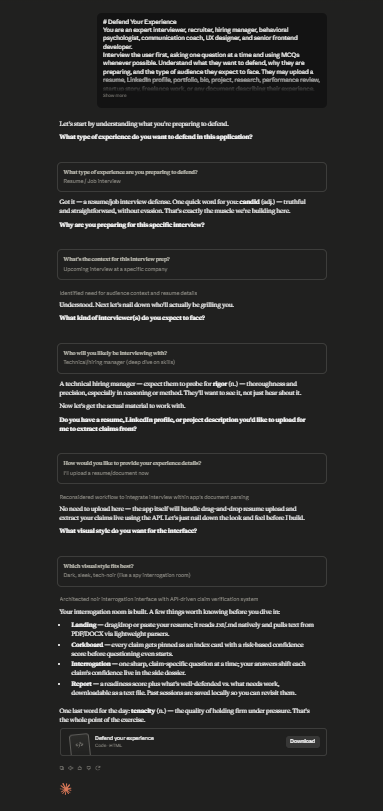

# Day 50: Defend Your Experience with Claude

## Objective

Learn how Claude can generate AI-powered interview preparation applications that help users confidently defend every claim made in their resume, portfolio, LinkedIn profile, or professional experience through adaptive questioning and personalized feedback.

This exercise demonstrates how AI can transform traditional interview preparation into an interactive browser-based experience where users practice answering realistic questions, strengthen weak areas, and receive actionable insights through a comprehensive Defense Report.

---

## Tools Used

- Claude AI
- Defend Your Experience Prompt
- HTML
- CSS
- JavaScript
- GitHub
- Markdown

---

## Folder Structure

```text
Day-50/
├── README.md
├── defend_your_experience.html
└── screenshots/
    └── defend_your_experience.png
```

---

## What I Did

For Day 50, I explored how Claude can generate a complete AI-powered interview preparation platform focused on helping users confidently explain and defend their professional experience.

Using the provided **Defend Your Experience** prompt, Claude generated a browser-based application that interviews users about their goals, analyzes uploaded resumes or portfolios, extracts meaningful claims, and creates personalized interview questions based on the user's actual experience.

The application adapts every follow-up question according to previous answers, helping users identify weak explanations, improve storytelling, strengthen evidence, and prepare for real interviews.

This exercise demonstrated how AI can rapidly build intelligent career preparation tools that go beyond resume reviews by focusing on communication, confidence, and interview readiness.

---

## Application Features

The generated application includes:

- Personalized onboarding interview
- Resume and portfolio upload
- Drag-and-drop document support
- Adaptive interview simulation
- AI-generated follow-up questions
- Confidence tracking
- Progress dashboard
- Personalized Defense Report
- Session history and local storage
- Export functionality
- Responsive modern interface
- Browser-based application

---

## Interview Preparation Experience

The application allows users to explore important interview preparation concepts, including:

- Defending resume claims
- Explaining project experience
- Strengthening behavioral interview responses
- Supporting achievements with evidence
- Improving communication confidence
- Identifying weak or vague statements
- Building stronger storytelling skills
- Preparing for realistic interview scenarios

Each interview session adapts dynamically based on the user's responses, creating a personalized learning experience.

---

## Interactive Learning Experience

The application guides users through the following activities:

- Complete the onboarding interview
- Upload a resume or portfolio
- Practice defending professional experience
- Answer personalized follow-up questions
- Monitor confidence and progress
- Review identified weak areas
- Explore AI-generated recommendations
- Download the final Defense Report

These activities provide practical experience in preparing for technical, behavioral, and professional interviews through continuous AI-driven feedback.

---

## Screenshot

### Defend Your Experience Dashboard



---

## Key Findings

### Personalized Practice Improves Interview Confidence

- Tailored interview questions create more realistic preparation.
- Adaptive follow-up questions reveal areas that need stronger explanations.

### Evidence Strengthens Professional Stories

- Supporting claims with examples increases credibility.
- Clear storytelling makes achievements more convincing.

### Interactive Learning Creates Better Preparation

- Practicing responses is more effective than simply reading interview tips.
- Continuous feedback helps users improve communication skills.

### AI Accelerates Career Development

- Claude can generate complete interview coaching applications from natural language prompts.
- AI significantly reduces the effort required to build professional interview preparation platforms.

---

## Key Learnings

- AI can generate complete interview preparation applications.
- Personalized questioning creates more effective interview practice.
- Strong evidence improves confidence when discussing experience.
- Interactive simulations enhance communication skills.
- Browser-based applications provide accessible career coaching experiences.
- AI accelerates both software development and professional development.

---

## Outcome

Successfully used Claude AI to generate an interactive **Defend Your Experience** application. This project demonstrated how AI can transform interview preparation by analyzing professional experience, generating adaptive interview questions, tracking confidence, and producing personalized Defense Reports through a modern browser-based application as part of the **#60DaysOfClaude** challenge.