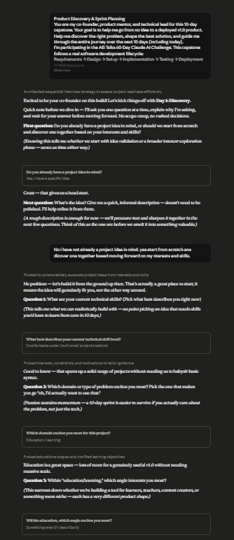
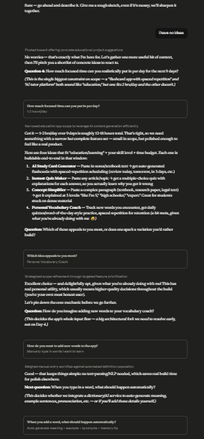
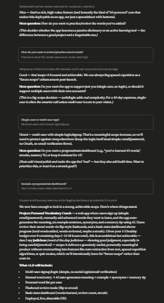
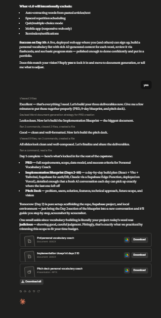

# Day 51: Product Discovery & Sprint Planning with Claude

## Objective

Learn how Claude can act as a structured product discovery partner by helping transform an idea into a realistic, well-scoped software project complete with a Product Requirements Document (PRD), implementation blueprint, and pitch deck.

This exercise demonstrates how AI can guide product planning through interviews, scope definition, documentation, and sprint planning before any code is written.

---

## Tools Used

- Claude AI
- Product Discovery & Sprint Planning Prompt
- Markdown
- Product Requirements Document (PRD)
- Implementation Blueprint
- Project Pitch Deck
- GitHub

---

## Folder Structure

```text
Day-51/
├── README.md
├── Implementation_Blueprint_Days_2-10.docx
├── Pitch_Deck_Personal_Vocabulary_Coach.pptx
├── PRD_Personal_Vocabulary_Coach.docx
└── screenshots/
    └── product_discovery.png
```

---

## What I Did

For Day 51, I explored how Claude can guide the complete product discovery process before beginning software development.

Using the provided **Product Discovery & Sprint Planning** prompt, Claude interviewed me step-by-step to understand my project idea, goals, target users, challenges, and desired outcomes. Through this structured conversation, the initial idea was refined into a realistic Version 1.0 product that could be completed within a 10-day capstone project.

Claude then generated three professional project documents: a comprehensive Product Requirements Document (PRD), a detailed implementation blueprint for Days 2–10, and a project pitch deck summarizing the product vision.

This exercise demonstrated how AI can function as both a product manager and technical planning partner, helping transform ideas into structured development plans.

---

## Application Features

The generated planning process includes:

- Interactive product discovery interview
- Project idea validation
- Feature prioritization
- Version 1.0 scope definition
- Scope exclusions
- Success criteria planning
- Product Requirements Document (PRD)
- Implementation Blueprint
- Project Pitch Deck
- Structured development roadmap

---

## Product Planning Experience

The project planning process allows users to explore important product management concepts, including:

- Defining project goals
- Understanding user needs
- Prioritizing core features
- Avoiding feature creep
- Creating realistic project timelines
- Planning sprint milestones
- Preparing development documentation
- Building a product roadmap

Each planning stage helps transform a rough idea into a structured software project ready for implementation.

---

## Interactive Learning Experience

The exercise guides users through the following activities:

- Complete the product discovery interview
- Compare and refine project ideas
- Finalize Version 1.0 scope
- Define project exclusions
- Review Day 10 success criteria
- Approve the final project summary
- Generate the Product Requirements Document
- Generate the Implementation Blueprint
- Generate the Project Pitch Deck
- Prepare for Days 2–10 development

These activities provide practical experience in product discovery, project planning, and software documentation.

---

## Screenshot

### Product Discovery Interview






---

## Key Findings

### Product Discovery Improves Project Success

- Structured interviews help clarify project goals before development begins.
- Defining user needs leads to better product decisions.

### Scope Discipline Prevents Feature Creep

- Clearly defining Version 1.0 keeps development realistic.
- Separating included and excluded features improves project focus.

### Documentation Improves Development

- A PRD provides a clear source of truth for the project.
- An implementation blueprint simplifies future development.

### AI Accelerates Product Planning

- Claude can generate complete product planning documentation from natural language conversations.
- AI significantly reduces the time required for product discovery and sprint planning.

---

## Key Learnings

- AI can support complete product discovery workflows.
- Well-defined scope increases project success.
- PRDs improve communication and development planning.
- Sprint planning creates a clear implementation roadmap.
- Professional documentation improves software development.
- AI accelerates product management and planning processes.

---

## Outcome

Successfully used Claude AI to complete the **Product Discovery & Sprint Planning** process. This project demonstrated how AI can transform an initial idea into a well-defined software product by generating a comprehensive Product Requirements Document, an implementation blueprint, and a project pitch deck, providing a strong foundation for the remaining days of the **#60DaysOfClaude** capstone challenge.