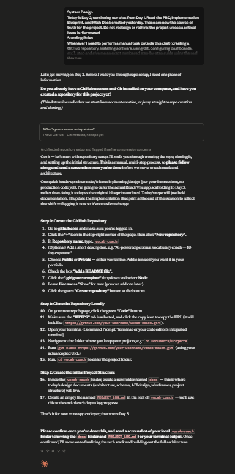

# Day 52: System Design & Technical Architecture with Claude

## Objective

Learn how Claude can transform product requirements into a complete technical design by creating a justified tech stack, system architecture, database schema, API specifications, UI wireframes, and project structure before writing production code.

This exercise demonstrates how AI can act as a software architect, helping developers design scalable applications through structured planning and documentation.

---

## Tools Used

- Claude AI
- System Design Prompt
- Mermaid Diagrams
- Markdown
- GitHub
- Product Requirements Document (PRD)
- Implementation Blueprint

---

## Folder Structure

```text
Day-52/
├── README.md
├── ARCHITECTURE.md
├── SCHEMA.md
├── API.md
├── UI-WIREFRAMES.md
├── PROJECT-STRUCTURE.md
├── IMPLEMENTATION-BLUEPRINT.md
└── screenshots/
    └── system_design.png
```

---

## What I Did

For Day 52, I continued building my capstone project by transforming the product requirements into a complete technical architecture.

Using the provided **System Design** prompt, Claude first reviewed the previously created Product Requirements Document (PRD), Implementation Blueprint, and Pitch Deck before proposing any technical decisions. Based on those documents, Claude recommended an appropriate technology stack, designed the system architecture, created the database schema, defined API contracts, mapped user flows, and organized the project folder structure.

The session concluded with a readiness review to ensure the project scope remained realistic and that implementation could begin immediately without additional planning.

This exercise demonstrated how AI can function as an experienced software architect by generating professional technical documentation before development starts.

---

## Deliverables Generated

The generated documentation includes:

- ARCHITECTURE.md
- SCHEMA.md
- API.md
- UI-WIREFRAMES.md
- PROJECT-STRUCTURE.md
- Updated Implementation Blueprint (if required)

---

## System Design Experience

The project planning process covered the following technical areas:

- Technology stack selection
- Frontend and backend architecture
- Database design
- Authentication strategy
- AI model integration
- API design
- Request lifecycle
- External service integration
- User flow planning
- Navigation structure
- Low-fidelity wireframes
- Project folder organization

Each decision was validated against the Product Requirements Document to ensure consistency and avoid unnecessary scope changes.

---

## Interactive Learning Experience

The exercise guides users through the following activities:

- Review the PRD and Blueprint
- Select and justify the technology stack
- Design the system architecture
- Create Mermaid diagrams
- Design the database schema
- Define REST API endpoints
- Review authentication and validation
- Design user flows and wireframes
- Organize the project structure
- Complete the Day 3 readiness review
- Generate technical documentation

These activities provide practical experience in software architecture, system design, and technical planning before implementation.

---

## Screenshot

### System Design Dashboard



---

## Key Findings

### Planning Before Coding Saves Time

- Designing the architecture first reduces implementation risks.
- Clear documentation prevents confusion during development.

### Technical Decisions Should Be Justified

- Every technology choice should align with project requirements.
- Selecting appropriate tools improves maintainability and scalability.

### Documentation Creates a Strong Foundation

- System architecture and API contracts provide a clear roadmap for developers.
- Database schemas ensure consistency throughout development.

### AI Accelerates Software Architecture

- Claude can generate complete technical documentation from natural language requirements.
- AI significantly reduces the effort required for architecture planning and technical design.

---

## Key Learnings

- AI can generate complete software architecture documentation.
- Technical planning improves project quality.
- Database schema and API design should be completed before implementation.
- Well-defined project structures simplify development.
- Mermaid diagrams improve system understanding.
- AI accelerates software architecture and engineering workflows.

---

## Outcome

Successfully used Claude AI to complete the **System Design & Technical Architecture** phase of my capstone project. This project demonstrated how AI can transform product requirements into professional architecture documents, database schemas, API specifications, wireframes, and project structures, creating a solid technical foundation for implementation as part of the **#60DaysOfClaude** challenge.