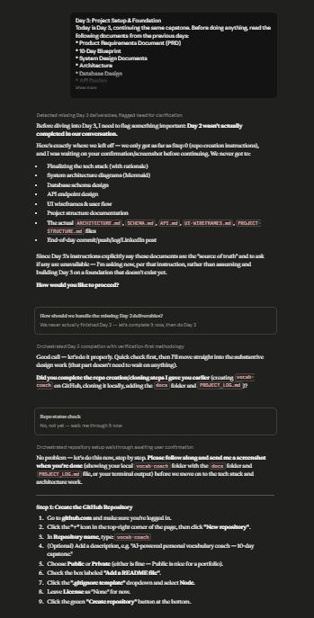
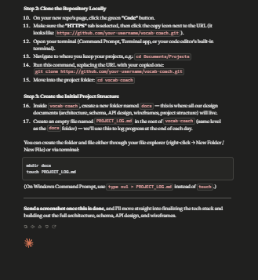

# Day 53: Project Setup & Foundation with Claude

## Objective

Learn how Claude can transform a completed system design into a working project foundation by setting up the development environment, initializing the project, configuring version control, and building the core application scaffolding before feature development begins.

This exercise demonstrates how AI can guide developers through professional project setup while ensuring the application aligns with the previously defined architecture and technical documentation.

---

## Tools Used

- Claude AI
- Project Setup & Foundation Prompt
- Git
- GitHub
- Node.js
- Package Manager (npm)
- Visual Studio Code
- HTML
- CSS
- JavaScript
- Markdown

---

## Folder Structure

```text
Day-53/
├── README.md
├── SETUP.md
├── PROJECT-STRUCTURE.md
├── ENVIRONMENT.md
├── DAY3-SUMMARY.md
└── screenshots/
    └── project_running.png
```

---

## What I Did

For Day 53, I moved from planning into implementation by setting up the development environment and creating the project foundation.

Using the provided **Project Setup & Foundation** prompt, Claude guided me through configuring the development environment, installing required tools and dependencies, initializing the project, connecting it to GitHub, and setting up a structured branching strategy.

After the project was initialized, I built the core application scaffolding, including routing, layout, navigation, authentication structure, database connection, API client configuration, shared components, state management, and project configuration.

Throughout the setup process, Claude explained the purpose of every major file and verified that the project successfully compiled without errors.

This exercise demonstrated how AI can simplify project initialization by providing step-by-step guidance while ensuring the implementation matches the previously designed architecture.

---

## Deliverables Generated

The generated documentation includes:

- SETUP.md
- PROJECT-STRUCTURE.md
- ENVIRONMENT.md
- DAY3-SUMMARY.md

---

## Project Foundation Experience

The setup process included the following activities:

- Development environment configuration
- Runtime installation
- IDE setup
- Package installation
- Project initialization
- Dependency management
- GitHub repository connection
- Branching strategy setup
- Routing configuration
- Application layout
- Navigation setup
- Authentication scaffold
- Database connection
- API client configuration
- Shared components
- State management
- Environment variables
- Initial project verification

Each step ensured the project was ready for feature development while remaining consistent with the architecture designed in previous days.

---

## Interactive Learning Experience

The exercise guides users through the following activities:

- Configure the development environment
- Install project dependencies
- Initialize the application
- Verify local project execution
- Connect the project to GitHub
- Configure branching strategy
- Build foundational scaffolding
- Review generated project files
- Debug setup issues
- Generate project documentation
- Verify successful build
- Prepare for feature implementation

These activities provide practical experience in professional project setup, environment configuration, and software engineering best practices.

---

## Screenshot

### Project Running Successfully





---

## Key Findings

### A Strong Foundation Improves Development

- Proper project setup reduces technical issues later in development.
- Building the foundation first makes feature implementation more efficient.

### Environment Consistency Matters

- Correct environment configuration ensures reliable development across different machines.
- Organized configuration files simplify project maintenance.

### Version Control Should Start Early

- Establishing a branching strategy from the beginning improves collaboration.
- Frequent commits make project history easier to manage.

### AI Accelerates Project Initialization

- Claude can generate professional project scaffolding from technical documentation.
- AI significantly reduces setup time while following software engineering best practices.

---

## Key Learnings

- AI can guide complete project initialization workflows.
- Environment configuration is essential for stable development.
- Foundational scaffolding should be completed before building features.
- Organized project structures improve maintainability.
- Git and branching strategies support better collaboration.
- AI accelerates software development from planning to implementation.

---

## Outcome

Successfully used Claude AI to complete the **Project Setup & Foundation** phase of my capstone project. The project now has a fully configured development environment, version control, project scaffolding, and supporting documentation, providing a solid foundation for feature implementation in the remaining days of the **#60DaysOfClaude** challenge.