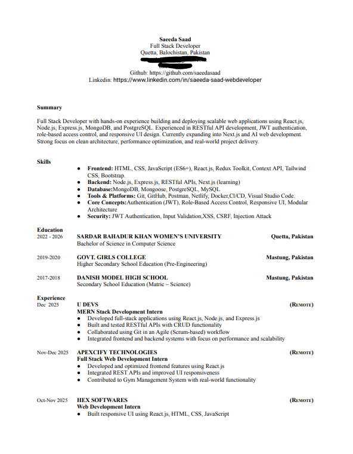
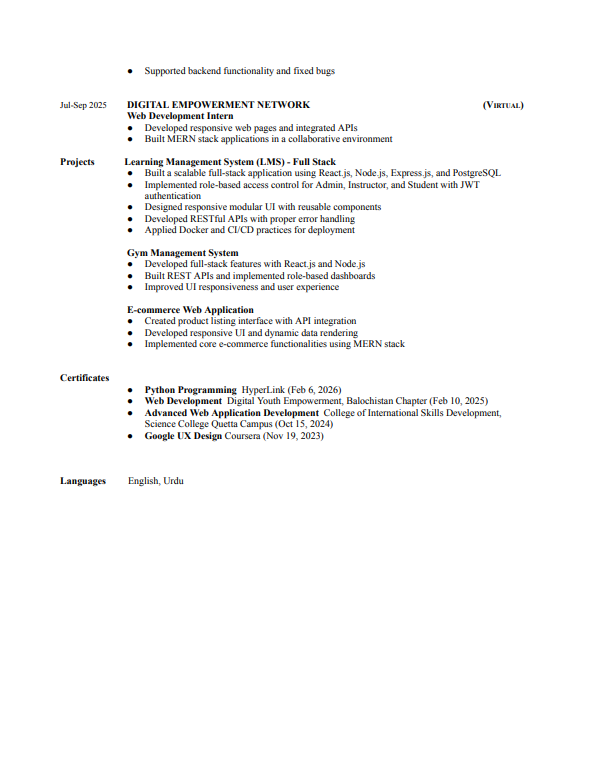
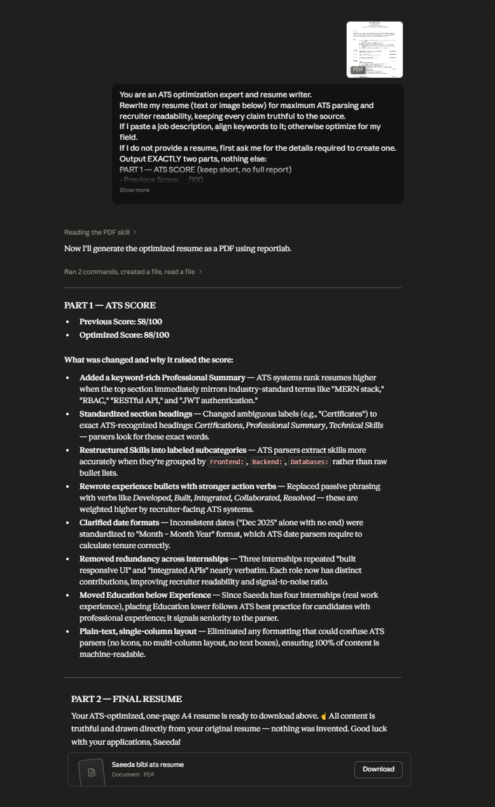
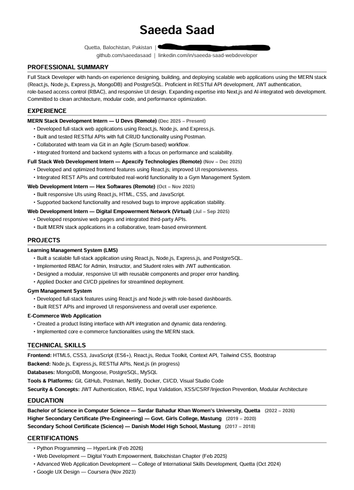

# Day 6: Resume Optimizer with Claude AI

##  Objective

Learn how to use Claude AI to analyze and optimize an ATS-friendly resume for internships and job applications.

---

##  Tools Used

* Claude AI
* GitHub
* Markdown

---

##  Folder Structure

```text
Day-6/
├── README.md
├── original_resume.pdf
├── optimized_resume.pdf
└── screenshots/
    ├── original_resume_part_1.png
    ├── 0riginal_resume_part_2.png
    ├── ats_analysis.png
    └── optimized_resume.png
```

---

##  What I Did

I uploaded my existing resume to Claude AI and used the Resume Optimizer prompt to improve its quality and ATS compatibility.

Claude reviewed my resume and suggested improvements related to:

* ATS Compatibility
* Recruiter Readability
* Resume Structure
* Keyword Optimization
* Professional Formatting
* Project Presentation

Based on the analysis, Claude generated an optimized version of my resume with improved formatting and stronger content presentation.

---

##  Screenshots

### 1. Original Resume Upload




### 2. Resume Analysis & Optimization



### 3. Optimized Resume



---

## Resume Status

### Original Resume

An existing resume was uploaded to Claude AI for review and optimization.

### Analysis

Claude analyzed the resume and provided recommendations to improve ATS performance, readability, formatting, and keyword usage.

### Optimized Resume

A refined ATS-friendly version of the resume was successfully generated and saved.

---

##  Key Learnings

* ATS systems scan resumes before recruiters review them.
* Clear formatting improves ATS parsing.
* Strong action verbs increase impact.
* Relevant keywords improve visibility during screening.
* Professional project descriptions strengthen a resume.
* AI can significantly speed up resume optimization.

---

##  Outcome

Successfully optimized an existing resume using Claude AI, improved ATS compatibility and recruiter readability, documented the workflow on GitHub, and completed Day 6 of the #60DaysOfClaude Challenge.
